import { Timeline } from 'astro-pure/user'

export function Container({ color, children }) {
  return (
    

      {children}
      
    

  )
}

export function TeamTable({
  link,
  name,
  nickname,
  fullName,
  teamChief,
  reserve,
  year,
  podiums,
  color,
  children
}) {
  return (
    

      
{children}

      

        

          

            <a className='text-foreground text-lg font-bold my-0' href={link} target='_blank'>
              {name}
            </a>
            {nickname && nickname !== '' && (
              
                {' '}
                [{nickname}]
              
            )}
          

          {fullName && 
{fullName}
}
        

        

          

            

              
领队

              
{teamChief}

            

            

              
预备车手

              
{reserve || '-'}

            

          

          

            {year} / 
            {podiums} 次领奖 / 
            {color}
          

        

      

    

  )
}

export function DriversTable({ drivers, children }) {
  return (
    

      {children}
      

        {drivers.map((driver, idx) => (
          

            

              
                {driver.abbr}
              
              

                <a className='text-foreground' href={driver.link} target='_blank'>
                  {driver.name}
                </a>
                {driver.nickname && driver.nickname != '' && (
                  
                    [{driver.nickname}]
                  
                )}
              

            

            

              #{driver.num} / 
              {new Date().getFullYear() - driver.birth} 岁 / 
              {driver.nation} / 
              {driver.podiums} 次领奖
            

          

        ))}
      

    

  )
}

其实官网本来就有长期在做 [F1 Teams 2025](https://www.formula1.com/en/teams)，但是纯英文有时候会不那么对应的上（同样的还有缩写），并且网络大部份资料还较为老旧，这就由此引出了本文。简单声明：

1. 本文按照官网顺序依次介绍所有车队，确保没有隐性个人倾向。
2. 领奖（登上领奖台，Podiums）次数是截至 2025 年初的统计数据。
3. 车手年龄为按照当前年份减去出生年份实时计算。

那么祝大家查阅愉快。

## McLaren

<Container color='#F47600'>
  <TeamTable
    link='https://www.formula1.com/en/teams/mclaren'
    name='迈凯伦'
    nickname='Toto Wolff'
    fullName='McLaren Formula 1 Team'
    teamChief='Andrea Stella'
    reserve='-'
    year='1966'
    podiums='434'
    color='橙&黑'
  >
    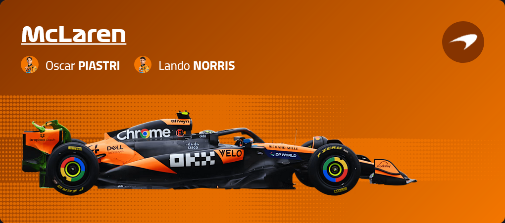
  </TeamTable>
  <DriversTable
    drivers={[
      {
        abbr: 'PIA',
        name: '奥斯卡 · 皮亚斯特里',
        nickname: '皮亚子',
        num: '81',
        birth: 2001,
        nation: '澳大利亚',
        podiums: '10',
        link: 'https://www.formula1.com/en/drivers/oscar-piastri'
      },
      {
        abbr: 'NOR',
        name: '兰多 · 诺里斯',
        nickname: '',
        num: '4',
        birth: 1999,
        nation: '英国',
        podiums: '26',
        link: 'https://www.formula1.com/en/drivers/lando-norris'
      }
    ]}
  >
    
  </DriversTable>
</Container>

## Ferrari

<Container color='#ED1131'>
  <TeamTable
    link='https://www.formula1.com/en/teams/ferrari'
    name='法拉利'
    nickname='窝法'
    fullName='Scuderia Ferrari HP'
    teamChief='Frédéric Vasseur 瓦塞尔'
    reserve='Antonio Giovinazzi, Zhou Guanyu'
    year='1950'
    podiums='636'
    color='红&白'
  >
    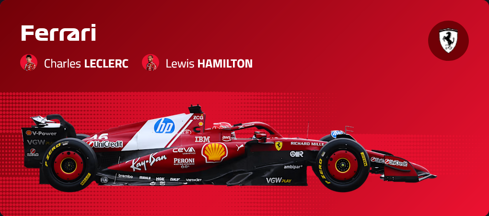
  </TeamTable>
  <DriversTable
    drivers={[
      {
        abbr: 'LEC',
        name: '查尔斯 · 勒克莱尔',
        nickname: '乐扣',
        num: '16',
        birth: 1997,
        nation: '摩纳哥',
        podiums: '43',
        link: 'https://www.formula1.com/en/drivers/charles-leclerc'
      },
      {
        abbr: 'HAM',
        name: '刘易斯 · 汉密尔顿',
        nickname: '老汉',
        num: '44',
        birth: 1985,
        nation: '英国',
        podiums: '202',
        link: 'https://www.formula1.com/en/drivers/lewis-hamilton'
      }
    ]}
  >
    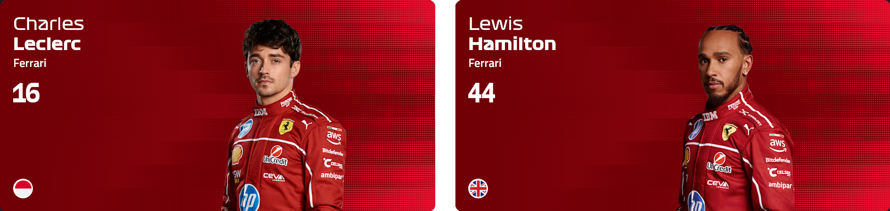
  </DriversTable>
</Container>

## Mercedes

<Container color='#00D7B6'>
  <TeamTable
    link='https://www.formula1.com/en/teams/mercedes'
    name='梅赛德斯'
    nickname='梅奔'
    fullName='Mercedes-AMG Petronas Formula One Team'
    teamChief='Toto Wolff 托托 / 马桶狼'
    reserve='Valtteri Bottas, Fred Vesti'
    year='1970'
    podiums='196'
    color='薄荷绿&黑'
  >
    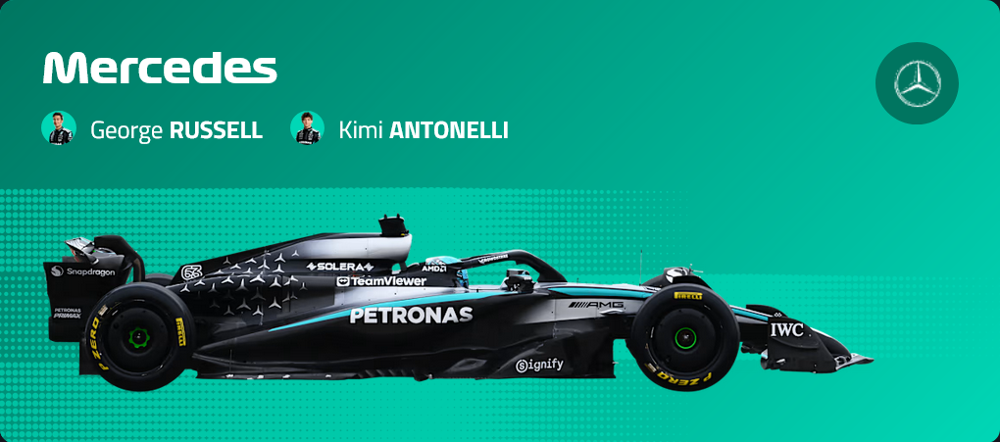
  </TeamTable>
  <DriversTable
    drivers={[
      {
        abbr: 'RUS',
        name: '乔治 · 拉塞尔',
        nickname: '皇帝',
        num: '63',
        birth: 1998,
        nation: '英国',
        podiums: '15',
        link: 'https://www.formula1.com/en/drivers/george-russell'
      },
      {
        abbr: 'ANT',
        name: '基米 · 安东内利',
        nickname: '小 Kimi',
        num: '12',
        birth: 2006,
        nation: '意大利',
        podiums: '0',
        link: 'https://www.formula1.com/en/drivers/kimi-antonelli'
      }
    ]}
  >
    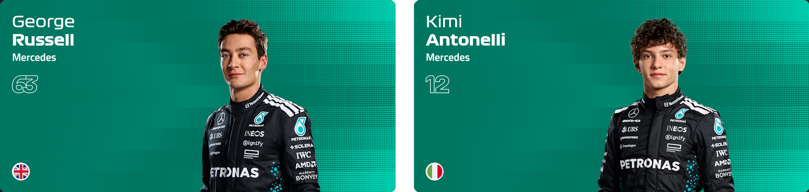
  </DriversTable>
</Container>

## Red Bull Racing

<Container color='#4781D7'>
  <TeamTable
    link='https://www.formula1.com/en/teams/red-bull-racing'
    name='红牛'
    nickname=''
    fullName='Oracle Red Bull Racing'
    teamChief='Laurent Mekies'
    reserve='-'
    year='1985'
    podiums='223'
    color='深蓝&红'
  >
    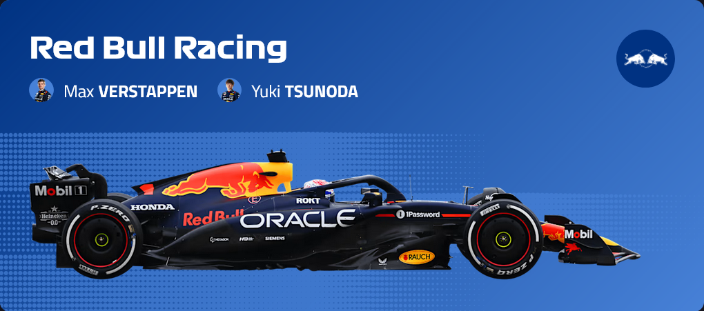
  </TeamTable>
  <DriversTable
    drivers={[
      {
        abbr: 'VER',
        name: '马克斯 · 维斯塔潘',
        nickname: '潘子 / 塔炮',
        num: '1',
        birth: 1997,
        nation: '荷兰',
        podiums: '85',
        link: 'https://www.formula1.com/en/drivers/max-verstappen'
      },
      {
        abbr: 'TSU',
        name: '角田裕毅',
        nickname: '脚甜',
        num: '22',
        birth: 2000,
        nation: '日本',
        podiums: '0',
        link: 'https://www.formula1.com/en/drivers/yuki-tsunoda'
      }
    ]}
  >
    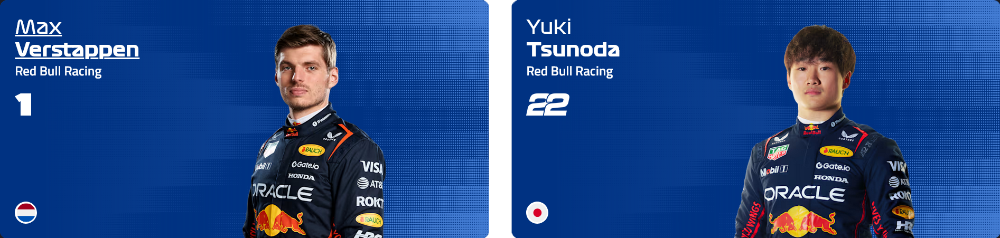
  </DriversTable>
</Container>

## Williams

<Container color='#1868DB'>
  <TeamTable
    link='https://www.formula1.com/en/teams/williams'
    name='威廉姆斯'
    nickname=''
    fullName='Atlassian Williams Racing'
    teamChief='James Vowles'
    reserve='-'
    year='1978'
    podiums='243'
    color='宝蓝&白'
  >
    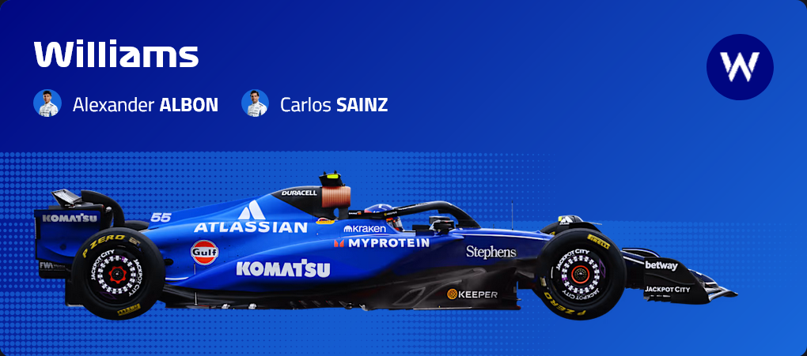
  </TeamTable>
  <DriversTable
    drivers={[
      {
        abbr: 'ALB',
        name: '亚历山大 · 阿尔本',
        nickname: '',
        num: '23',
        birth: 1996,
        nation: '泰国',
        podiums: '2',
        link: 'https://www.formula1.com/en/drivers/alexander-albon'
      },
      {
        abbr: 'SAI',
        name: '卡洛斯 · 塞恩斯',
        nickname: '',
        num: '55',
        birth: 1994,
        nation: '西班牙',
        podiums: '27',
        link: 'https://www.formula1.com/en/drivers/carlos-sainz'
      }
    ]}
  >
    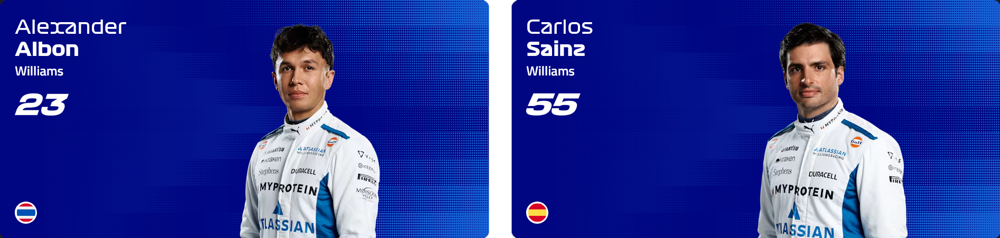
  </DriversTable>
</Container>

## Racing Bulls

<Container color='#6C98FF'>
  <TeamTable
    link='https://www.formula1.com/en/teams/racing-bulls'
    name='红牛二队'
    nickname='小红牛'
    fullName='Visa Cash App Racing Bulls Formula One Team'
    teamChief='Alan Permane'
    reserve='Ayumu Iwasa'
    year='1985'
    podiums='5'
    color='蓝&白'
  >
    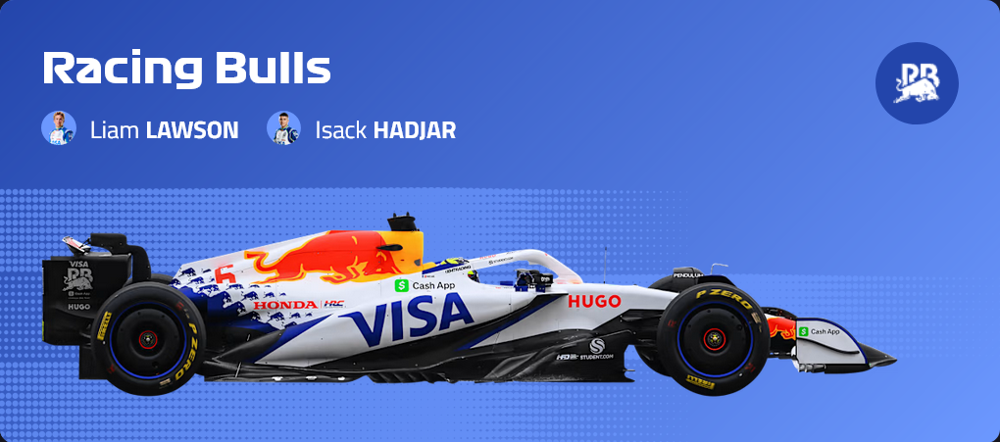
  </TeamTable>
  <DriversTable
    drivers={[
      {
        abbr: 'LAW',
        name: '‌利亚姆 · 劳森',
        nickname: '',
        num: '30',
        birth: 2002,
        nation: '新西兰',
        podiums: '0',
        link: 'https://www.formula1.com/en/drivers/liam-lawson'
      },
      {
        abbr: 'HAD',
        name: '伊萨克 · 哈贾尔',
        nickname: '',
        num: '6',
        birth: 2004,
        nation: '法国',
        podiums: '0',
        link: 'https://www.formula1.com/en/drivers/isack-hadjar'
      }
    ]}
  >
    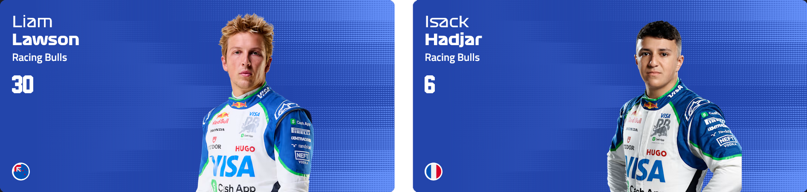
  </DriversTable>
</Container>

## Haas

<Container color='#9C9FA2'>
  <TeamTable
    link='https://www.formula1.com/en/teams/haas'
    name='哈斯'
    nickname=''
    fullName='MoneyGram Haas F1 Team'
    teamChief='Ayao Komatsu'
    reserve='Ryo Hirakawa'
    year='2016'
    podiums='0'
    color='黑白&红'
  >
    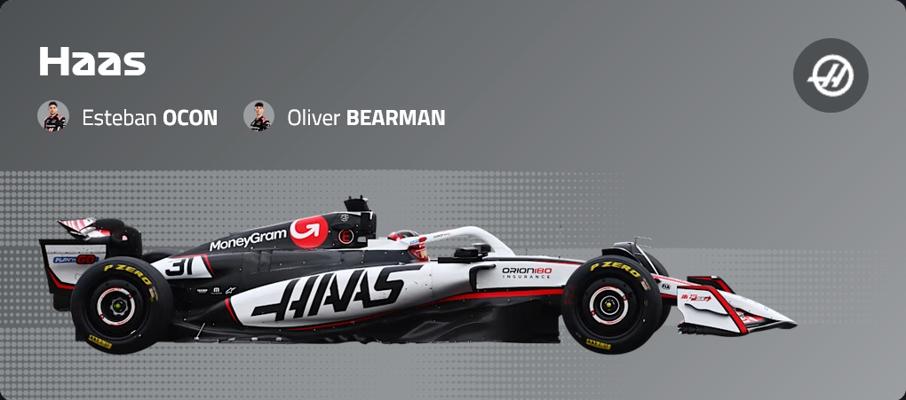
  </TeamTable>
  <DriversTable
    drivers={[
      {
        abbr: 'OCO',
        name: '埃斯特班 · 奥康',
        nickname: '',
        num: '31',
        birth: 1996,
        nation: '法国',
        podiums: '4',
        link: 'https://www.formula1.com/en/drivers/esteban-ocon'
      },
      {
        abbr: 'BEA',
        name: '奥利弗 · 贝尔曼',
        nickname: '熊人',
        num: '87',
        birth: 2005,
        nation: '英国',
        podiums: '0',
        link: 'https://www.formula1.com/en/drivers/oliver-bearman'
      }
    ]}
  >
    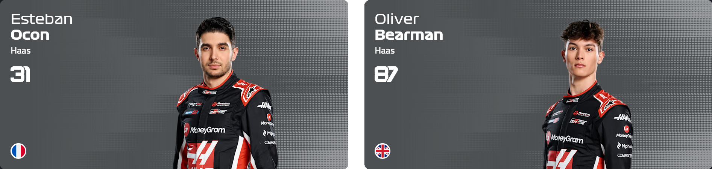
  </DriversTable>
</Container>

## Aston Martin

<Container color='#229971'>
  <TeamTable
    link='https://www.formula1.com/en/teams/aston-martin'
    name='阿斯顿马丁'
    nickname=''
    fullName='Aston Martin Aramco Formula One Team'
    teamChief='Andy Cowell'
    reserve='Felipe Drugovich, Stoffel Vandoorne'
    year='2018'
    podiums='12'
    color='马尔代夫绿'
  >
    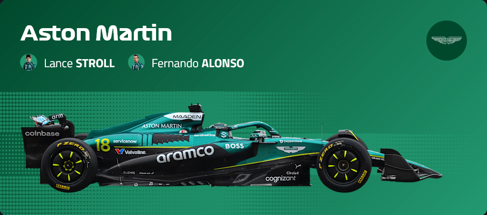
  </TeamTable>
  <DriversTable
    drivers={[
      {
        abbr: 'STR',
        name: '兰斯 · 斯特罗尔',
        nickname: '太子 / 少爷',
        num: '18',
        birth: 1998,
        nation: '加拿大',
        podiums: '3',
        link: 'https://www.formula1.com/en/drivers/lance-stroll'
      },
      {
        abbr: 'ALO',
        name: '费尔南多 · 阿隆索',
        nickname: '头哥',
        num: '14',
        birth: 1981,
        nation: '西班牙',
        podiums: '106',
        link: 'https://www.formula1.com/en/drivers/fernando-alonso'
      }
    ]}
  >
    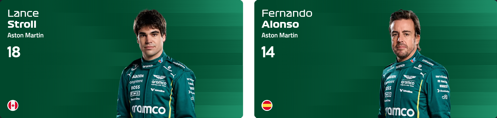
  </DriversTable>
</Container>

## Kick Sauber

<Container color='#01C00E'>
  <TeamTable
    link='https://www.formula1.com/en/teams/kick-sauber'
    name='Kick 索伯'
    nickname=''
    fullName='Stake F1 Team Kick Sauber'
    teamChief='Jonathan Wheatley'
    reserve='-'
    year='1993'
    podiums='26'
    color='绿&黑'
  >
    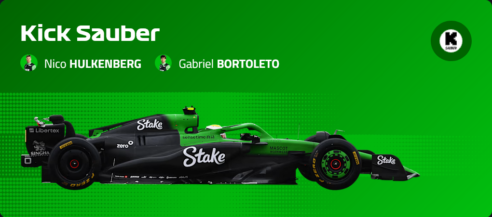
  </TeamTable>
  <DriversTable
    drivers={[
      {
        abbr: 'HUL',
        name: '尼科 · 霍肯伯格',
        nickname: '侯根宝',
        num: '27',
        birth: 1987,
        nation: '德国',
        podiums: '0',
        link: 'https://www.formula1.com/en/drivers/nico-hulkenberg'
      },
      {
        abbr: 'BOR',
        name: '加布里埃尔 · 博托莱托',
        nickname: '',
        num: '5',
        birth: 2004,
        nation: '巴西',
        podiums: '0',
        link: 'https://www.formula1.com/en/drivers/gabriel-bortoleto'
      }
    ]}
  >
    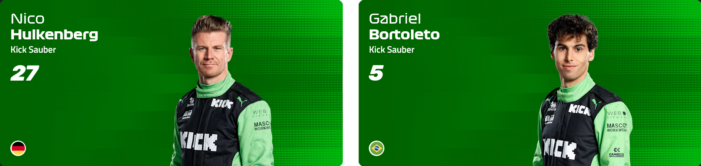
  </DriversTable>
</Container>

## Alpine

<Container color='#00A1E8'>
  <TeamTable
    link='https://www.formula1.com/en/teams/alpine'
    name='Alpine'
    nickname=''
    fullName='BWT Alpine Formula One Team'
    teamChief='Flavio Briatore 布里亚托利'
    reserve='Jack Doohan, Paul Aron, Kush Maini'
    year='1986'
    podiums='60'
    color='蓝&粉&黑'
  >
    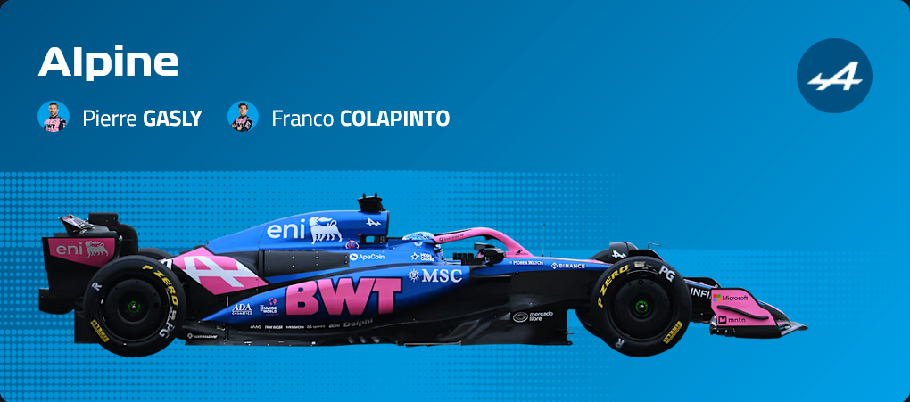
  </TeamTable>
  <DriversTable
    drivers={[
      {
        abbr: 'GAS',
        name: '皮埃尔 · 加斯利',
        nickname: '加大师',
        num: '10',
        birth: 1996,
        nation: '法国',
        podiums: '5',
        link: 'https://www.formula1.com/en/drivers/pierre-gasly'
      },
      {
        abbr: 'COL',
        name: '弗兰科 · 克拉平托',
        nickname: '可乐瓶',
        num: '43',
        birth: 2003,
        nation: '阿根廷',
        podiums: '0',
        link: 'https://www.formula1.com/en/drivers/franco-colapinto'
      }
    ]}
  >
    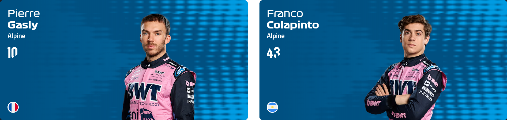
  </DriversTable>
</Container>

## Updates

<Timeline
  events={[
    {
      date: '2025-07-11',
      content: '红牛架构调整，移除 Christian Horner 霍纳'
    },
    {
      date: '2025-11-06',
      content: '追更部分车手外号'
    }
  ]}
/>
