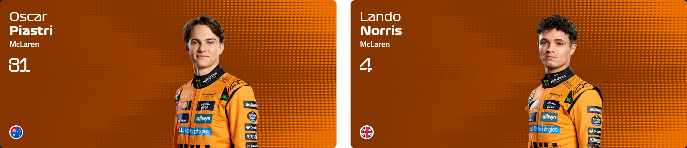

export function Container({ color, children }) {
  return (
    

      {children}
      
    

  )
}

export function TeamTable({ link, name, desc, techChief, color, reserve, year, children }) {
  return (
    

      
{children}

      

        

          <a className='text-foreground text-lg font-bold my-0'
            href={link} target='_blank'>{name}</a>
          {desc && 
{desc}
}
        

        

          

            
技术总监

            
{techChief}

          

          

            
预备车手

            
{reserve || "-"}

          

          

            
年份

            
{year}

          

          

            
涂装

            
{color}

          

        

      

    

  )
}

export function DriversTable({ drivers, children }) {
  return (
    

      {children}
      

        {drivers.map((driver, idx) => (
          

            

              {driver.abbr}
              <a className='max-sm:order-3 text-foreground'
                href={driver.link} target='_blank'>{driver.name}</a>
              #{driver.num}
            

            

              {new Date().getFullYear() - driver.birth} 岁 / 
              {driver.nation} / 
              {driver.award} 次领奖
            

          

        ))}
      

    

  )
}

其实官网本来就有长期在做 [F1 Teams 2025](https://www.formula1.com/en/teams)，但是纯英文有时候会不那么对应的上（同样的还有缩写），并且网络大部份资料还较为老旧，这就由此引出了本文。简单声明：

1. 本文按照官网顺序依次介绍所有车队，确保没有隐性个人倾向。
2. 领奖（登上领奖台，Podiums）次数是截至 2025 年初的统计数据。
3. 车手年龄为按照当前年份减去出生年份实时计算。

那么祝大家查阅愉快。

## McLaren

<Container color="#F47600">
  <TeamTable
    link="https://www.formula1.com/en/teams/mclaren"
    name="迈凯伦"
    desc="McLaren Formula 1 Team"
    techChief="Peter Prodromou / Neil Houldey"
    reserve="-"
    year="1966"
    color="橙、黑">
    
  </TeamTable>
  <DriversTable
    drivers={[
      { abbr: "PIA", name: "奥斯卡 · 皮亚斯特里", num: "81", birth: 2001, nation: "澳大利亚", award: "10", link: "https://www.formula1.com/en/drivers/oscar-piastri" },
      { abbr: "NOR", name: "兰多 · 诺里斯", num: "4", birth: 1999, nation: "英国", award: "26", link: "https://www.formula1.com/en/drivers/lando-norris" }
    ]}
  >
    
  </DriversTable>
</Container>

## Mercedes

<Container color="#00D7B6">
  <TeamTable
    link="https://www.formula1.com/en/teams/mercedes"
    name="梅赛德斯"
    desc="Mercedes-AMG Petronas Formula One Team"
    techChief="James Allison"
    reserve="Valtteri Bottas, Fred Vesti"
    year="1970"
    color="黑、薄荷绿、白">
    
  </TeamTable>
  <DriversTable
    drivers={[
      { abbr: "RUS", name: "乔治 · 拉塞尔", num: "63", birth: 1998, nation: "英国", award: "15", link: "https://www.formula1.com/en/drivers/george-russell" },
      { abbr: "ANT", name: "基米 · 安东内利", num: "12", birth: 2006, nation: "意大利", award: "0", link: "https://www.formula1.com/en/drivers/kimi-antonelli" }
    ]}>
    
  </DriversTable>
</Container>

## Ferrari

<Container color="#ED1131">
  <TeamTable
    link="https://www.formula1.com/en/teams/ferrari"
    name="法拉利"
    desc="Scuderia Ferrari HP"
    techChief="Loic Serra / Enrico Gualtieri"
    reserve="Antonio Giovinazzi, Zhou Guanyu"
    year="1950"
    color="红、白">
    
  </TeamTable>
  <DriversTable
    drivers={[
      { abbr: "LEC", name: "查尔斯 · 勒克莱尔", num: "16", birth: 1997, nation: "摩纳哥", award: "43", link: "https://www.formula1.com/en/drivers/charles-leclerc" },
      { abbr: "HAM", name: "刘易斯 · 汉密尔顿", num: "44", birth: 1985, nation: "英国", award: "202", link: "https://www.formula1.com/en/drivers/lewis-hamilton" }
    ]}>
    
  </DriversTable>
</Container>

## Red Bull Racing

<Container color="#4781D7">
  <TeamTable
    link="https://www.formula1.com/en/teams/red-bull-racing"
    name="红牛"
    desc="Oracle Red Bull Racing"
    techChief="Pierre Waché"
    reserve="-"
    year="1985"
    color="深蓝、红">
    
  </TeamTable>
  <DriversTable
    drivers={[
      { abbr: "VER", name: "马克斯 · 维斯塔潘（维神）", num: "1", birth: 1997, nation: "荷兰", award: "85", link: "https://www.formula1.com/en/drivers/max-verstappen" },
      { abbr: "TSU", name: "角田裕毅", num: "22", birth: 2000, nation: "日本", award: "0", link: "https://www.formula1.com/en/drivers/yuki-tsunoda" }
    ]}>
    
  </DriversTable>
</Container>

## Williams

<Container color="#1868DB">
  <TeamTable
    link="https://www.formula1.com/en/teams/williams"
    name="威廉姆斯"
    desc="Atlassian Williams Racing"
    techChief="Pat Fry"
    reserve="-"
    year="1978"
    color="宝蓝、白">
    
  </TeamTable>
  <DriversTable
    drivers={[
      { abbr: "ALB", name: "亚历山大 · 阿尔本", num: "23", birth: 1996, nation: "泰国", award: "2", link: "https://www.formula1.com/en/drivers/alexander-albon" },
      { abbr: "SAI", name: "卡洛斯 · 塞恩斯", num: "55", birth: 1994, nation: "西班牙", award: "27", link: "https://www.formula1.com/en/drivers/carlos-sainz" }
    ]}>
    
  </DriversTable>
</Container>

## Haas

<Container color="#9C9FA2">
  <TeamTable
    link="https://www.formula1.com/en/teams/haas"
    name="哈斯"
    desc="MoneyGram Haas F1 Team"
    techChief="Andrea De Zordo"
    reserve="Ryo Hirakawa"
    year="2016"
    color="黑、红、白">
    
  </TeamTable>
  <DriversTable
    drivers={[
      { abbr: "OCO", name: "埃斯特班 · 奥康", num: "31", birth: 1996, nation: "法国", award: "4", link: "https://www.formula1.com/en/drivers/esteban-ocon" },
      { abbr: "BEA", name: "奥利弗 · 贝尔曼", num: "87", birth: 2005, nation: "英国", award: "0", link: "https://www.formula1.com/en/drivers/oliver-bearman" }
    ]}>
    
  </DriversTable>
</Container>

## Racing Bulls

<Container color="#6C98FF">
  <TeamTable
    link="https://www.formula1.com/en/teams/racing-bulls"
    name="红牛二队 / 小红牛 / 青年红牛"
    desc="Visa Cash App Racing Bulls Formula One Team"
    techChief="Tim Goss"
    reserve="Ayumu Iwasa"
    year="1985"
    color="白、蓝">
    
  </TeamTable>
  <DriversTable
    drivers={[
      { abbr: "LAW", name: "‌利亚姆 · 劳森", num: "30", birth: 2002, nation: "新西兰", award: "0", link: "https://www.formula1.com/en/drivers/liam-lawson" },
      { abbr: "HAD", name: "伊萨克 · 哈贾尔", num: "6", birth: 2004, nation: "法国", award: "0", link: "https://www.formula1.com/en/drivers/isack-hadjar" }
    ]}>
    
  </DriversTable>
</Container>

## Aston Martin

<Container color="#229971">
  <TeamTable
    link="https://www.formula1.com/en/teams/aston-martin"
    name="阿斯顿马丁"
    desc="Aston Martin Aramco Formula One Team"
    techChief="Eric Blandin"
    reserve="Felipe Drugovich, Stoffel Vandoorne"
    year="2018"
    color="马尔代夫绿、白">
    
  </TeamTable>
  <DriversTable
    drivers={[
      { abbr: "STR", name: "兰斯 · 斯特罗尔（太子 / 少爷）", num: "18", birth: 1998, nation: "加拿大", award: "3", link: "https://www.formula1.com/en/drivers/lance-stroll" },
      { abbr: "ALO", name: "费尔南多 · 阿隆索（头哥）", num: "14", birth: 1981, nation: "西班牙", award: "106", link: "https://www.formula1.com/en/drivers/fernando-alonso" }
    ]}>
    
  </DriversTable>
</Container>

## Kick Sauber

<Container color="#01C00E">
  <TeamTable
    link="https://www.formula1.com/en/teams/kick-sauber"
    name="Kick 索伯"
    desc="Stake F1 Team Kick Sauber"
    techChief="James Key"
    reserve="-"
    year="1993"
    color="绿、黑">
    
  </TeamTable>
  <DriversTable
    drivers={[
      { abbr: "HUL", name: "尼科 · 霍肯伯格", num: "27", birth: 1987, nation: "德国", award: "0", link: "https://www.formula1.com/en/drivers/nico-hulkenberg" },
      { abbr: "BOR", name: "加布里埃尔 · 博托莱托", num: "5", birth: 2004, nation: "巴西", award: "0", link: "https://www.formula1.com/en/drivers/gabriel-bortoleto" }
    ]}>
    
  </DriversTable>
</Container>

## Alpine

<Container color="#00A1E8">
  <TeamTable
    link="https://www.formula1.com/en/teams/alpine"
    name="Alpine"
    desc="BWT Alpine Formula One Team"
    techChief="David Sanchez"
    reserve="Jack Doohan, Paul Aron, Kush Maini"
    year="1986"
    color="粉、蓝、黑">
    
  </TeamTable>
  <DriversTable
    drivers={[
      { abbr: "GAS", name: "皮埃尔 · 加斯利", num: "10", birth: 1996, nation: "法国", award: "5", link: "https://www.formula1.com/en/drivers/pierre-gasly" },
      { abbr: "COL", name: "弗兰科 · 科拉平托", num: "43", birth: 2003, nation: "阿根廷", award: "0", link: "https://www.formula1.com/en/drivers/franco-colapinto" }
    ]}>
    
  </DriversTable>
</Container>
