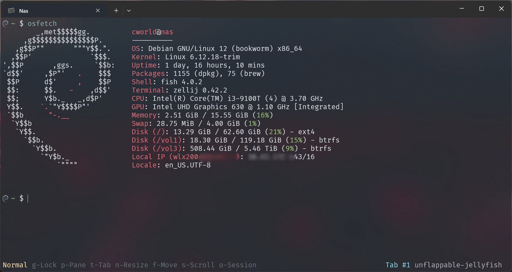
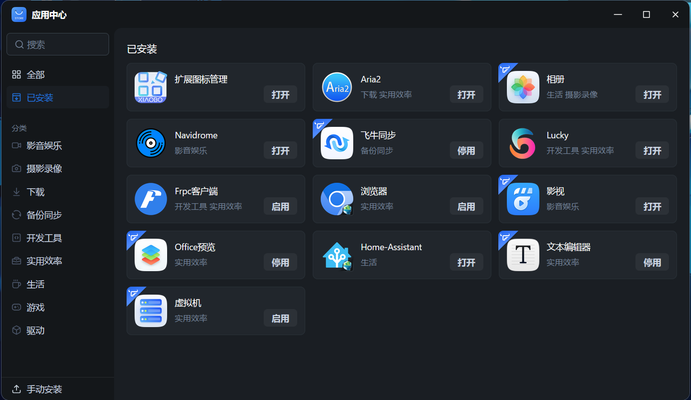
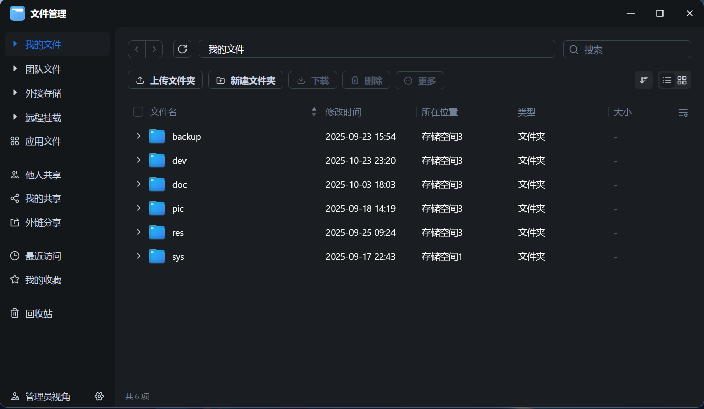

这篇文章并没有讲很多有关 “我为什么要买 Nas” 或者 “Nas 在我的生活中扮演了什么样的角色”。因为这样的讨论注定会是主观的，因人而异。如你所见，这只是一个平平无奇的记录帖，也希望在你从零开始折腾 Nas 时可以用上这些小技巧。

## 硬件配置



较为简单的穷酸配置。盘是 tb 买的翻新希捷，目前体验良好，晚上噪声忽略不计。系统采用轻量可靠的飞牛 FnOS，体验良好。

## 系统配置

飞牛自带的装了这些：



Docker方面目前保留了：

1. Home assistant 无需多言
2. Music tag web：速刮削和整理音乐，按需启用
3. 官方 Chromium 急救用，一般不开
4. rdesktop: 由 linuxserver 团队维护，虽然地位一般更新延迟，但架不住底层好，可直接使用微软发布的远程桌面工具（RDP）连接，体验丝滑
5. webtop: 比 rdesktop 维护勤快很多，区别主要在于使用浏览器 VNC 访问。由于介质稳定性，移动端体验较差。

### 目录



由于本人很讨厌啥都加复数（如果要追究复数那要加的 s 可就很多了），目录规划也使用缩写名称，有效降低路径长度，方便后续维护。

部分 Docker 等目录放到固态存储的 `sys` 内，这样方便使用机械硬盘休眠功能。电脑侧栏直接设置为 Nas 有关目录，可更无缝体验多端协同和远程存储。

### 影视


影视库能刮削百度、阿里、夸克等网盘里的电影，但是似乎播放测试还是不太行，可能是我没开会员吧。感觉还是下载下来看更稳定。

看番推荐 Dandan Play（弹弹 Play），可直接播放来自 Nas 的内容，提供完整的弹幕体验。

### 相册

相册按照出行档期按照时间建立文件夹。除了实况必须 mov + heic/仅转换的jpg 外，其他功能使用良好。该有的功能都有。使用期间发现搬迁目录会有残留，还是得卸载相册重装才能解决。笔者这里建议初始安装目录一定要选好，免得后面破事一堆。

### 音乐

真希望飞牛音乐能早点到来。目前使用 Navidrome，PC 用 feishin，iOS 用 LMP Music，算是够用，但是新设备听音乐就只能靠上古 Web 界面了。

### 导航

笔者开源了 [Nas Dashboard](https://github.com/cworld1/nas-dashboard) 项目；但由于最近飞牛官方放开本地安装，推荐使用 [扩展图标管理](https://club.fnnas.com/forum.php?mod=viewthread&tid=41357)，更好兼容移动端（然而移动端测试图标貌似是没法自定义的），体验更原生轻便。

### 备份

官方支持了备份到云服务功能。自己按需备份即可。反正你们都是不缺大容量网盘的，是吧。

## 穿透

穿透主要渠道：

- 流量中转/穿透（FnConnect/Frp/组网软件中转）
- P2P 打洞（穿透 NAT 解决问题）
- 直接暴露在公网（暴露服务/流量加密/组网软件P2P模式）

一般自己准备两条路径就足够了。问题一般不在稳定性而是速度。此外“暴露在公网”和“穿透”模式应注意防护。下面分类展开。

暴露服务 & 穿透：

- 裸露在公网的 http 流量应使用 TLS 加密（即给链接上 HTTPS）
- SSH 流量是已知最简单安全的加密方式（？），使用 SSH tunneling 进行远程 Web 服务转发不失为一种选择。例如使用 `ssh -L 5666:127.0.0.1:5666`
- SMB 流量貌似是加密的，不过一方面是政策原因没法使用默认端口，另一方面也因为安全不建议使用默认端口，导致 Windows 这个只接受默认端口的生物无法很好接纳远程访问这一点。如要使用，更推荐虚拟组网使用。
- ipv6 彻底放开个人认为是个非常危险的方案，可能个人设备防护的还算比较好，但你家的摄像头等智能家居就不好说了。如果被他人入侵并采取操作，后果将不堪设想。嗯，尤其是摄像头。
- 将光猫流量桥接到个人路由器后，推荐务必将路由器的防火墙做好，仅开放需要的端口。
- 会折腾的话，也可以使用中转网络服务层，设立专门的蜜罐，有效拦截外来扫端口黑客。
- 即使因为一些原因在互联网上公开，开放的端口同样要做好鉴权工作，设立账号密码。

流量加密这点就不展开讲述了。

虚拟组网：目前主流虚拟组网方案有 ZeroTier、Tailscale、EasyTier、Wireguard。当然还有一些冷门一点的方案。安全性一般都足够，但大多都具有较为明显的流量特征，不排除受到运营商/公司 IT 管制的风险。

## 无线网卡上网

查看有关信息：

```shell
nmcli device status
lspci -k
```

有时候重启系统服务是个不错的决定：

```shell
sudo systemctl restart NetworkManager
```

最后使用命令查看上网信息和 IP 分配：

```shell
ip route
default via 10.65.255.1 dev enp1s0 proto static metric 100
10.65.255.1 dev enp1s0 proto static scope link metric 100
172.17.0.0/16 dev br-be1a5d2c2cd4 proto kernel scope link src 172.17.0.1 linkdown
172.31.0.0/16 dev docker0 proto kernel scope link src 172.31.0.1
192.168.1.0/24 dev enp1s0 proto kernel scope link src 192.168.1.1 metric 100
192.168.43.0/24 dev wlx200db*** proto kernel scope link src 192.168.43.203 metric 600
```

## 网络共享

为了对策校园网这种膈应人的产品，我决定将服务器的网络通过网线共享给我的 Windows 电脑，并由此摸索出了这样一套方案：

> 如果你也受困于校园网但是距离毕业尚早，请考虑购入二手路由并学习如何折腾。这会更加方便实用。

### 安装 & 配置静态 IP

```shell
sudo apt update
sudo apt install iptables dnsmasq
```

编辑 `/etc/network/interfaces` 文件：

```shell
sudo nano /etc/network/interfaces
```

确保 `enp1s0` 接口的配置为某个静态 IP：

```plaintext
auto enp1s0
iface enp1s0 inet static
    address 192.168.1.1
    netmask 255.255.255.0
```

然后重启服务以应用它。

```shell
sudo systemctl restart networking
```

> 值得一提的是，上述步骤可以使用飞牛自带的设置里面，使用图形化界面完成。

### 配置 DHCP 服务器

编辑 `/etc/dnsmasq.conf` 文件配置 DHCP 服务：

```plaintext
interface=enp1s0
dhcp-range=192.168.1.2,192.168.1.100,255.255.255.0,24h
```

这会类似于 DHCP 服务器，为你的电脑分配正确的 IP 地址。当然不要忘记重启 dnsmasq 服务：

```shell
sudo systemctl restart dnsmasq
```

### 配置 IP 转发

编辑 `/etc/sysctl.conf` 文件。不出意外的话你应该能找到注释好的配置。找到并取消注释（或添加）：

```plaintext
net.ipv4.ip_forward=1
```

然后应用更改即可：

```shell
sudo sysctl -p
```

### 配置防火墙规则

使用 `iptables` 设置 NAT 规则，以便通过 Wi-Fi 连接到互联网：

```shell
sudo iptables -t nat -A POSTROUTING -o wlx200db0449243 -j MASQUERADE
sudo iptables -A FORWARD -i wlx200db0449243 -o enp1s0 -m state --state RELATED,ESTABLISHED -j ACCEPT
sudo iptables -A FORWARD -i enp1s0 -o wlx200db0449243 -j ACCEPT
```

### Windows 配置

1. 将 Windows 电脑通过网线连接到服务器的 `enp1s0` 接口。
2. 理论上 Windows 电脑应该能够获取到一个被分配的 IP 地址（例如 192.168.1.2），并能够访问互联网。

### 注意事项

有时候电脑的休眠会让服务器触发某些特殊状态（当然也不排除是飞牛的锅），你可能需要在唤醒后手动执行：

```shell
sudo ip route del default via 10.65.255.1 dev enp1s0 proto static metric 100
```

当然也不一定是 `10.65.255.1`，按照 `ip route` 自行查看 default 是啥。

以及一些检查 IP 表的命令：

```shell
sudo iptables -L -v -n
sudo iptables -t nat -L -v -n
```

### 网络共享下的远程

这样的流量转发模式下，还想要外网 IP 地址访问 Windows 电脑，就需要在服务器上配置对应的端口转发。

#### Windows 端配置

1. 在 Windows 电脑上，右键点击“此电脑”或“我的电脑”，选择“属性”。
2. 点击“远程设置”。
3. 在“远程”选项卡中，确保选中“允许远程连接到此计算机”。
4. 如果有防火墙提示，确保允许远程桌面通过防火墙。

确保 Windows 防火墙允许 RDP 连接：

1. 打开“控制面板”，选择“系统和安全”。
2. 点击“Windows 防火墙”。
3. 在左侧，点击“允许应用通过 Windows 防火墙”。
4. 确保“远程桌面”选项被勾选。

打开命令提示符（cmd）或 Pwsh，输入以下命令以获取其 IP 地址：

```shell
ipconfig
```

记下对应的 IP 地址。

#### Debian 服务器配置

下面的情况将以这样的配置为例：

- Windows 电脑 IP 地址：192.168.1.2
- 默认 RDP 端口：3389

设立 iptables 转发：

```shell
sudo iptables -t nat -A PREROUTING -p tcp --dport 3389 -j DNAT --to-destination 192.168.1.2:3389
sudo iptables -A FORWARD -p tcp -d 192.168.1.2 --dport 3389 -m state --state NEW,RELATED,ESTABLISHED -j ACCEPT
```

#### 连接到 Windows 电脑

1. 远程设备上打开远程桌面连接应用（比如微软官方的 Windows）。
2. 输入服务器的外网 IP 地址，格式为 `外网IP:3389`。然后点击连接开始享用！

## 切换TCP拥塞控制算

[使用bbr法突破运营商限速](https://www.geekxw.top/3307/)

启用：

```shell
sudo -i
echo -e "\nnet.core.default_qdisc=fq\nnet.ipv4.tcp_congestion_control=bbr" >> /etc/sysctl.conf && sysctl -p
sysctl net.ipv4.tcp_congestion_control
```

恢复：

```shell
vim /etc/sysctl.conf
# 删除
# net.core.default_qdisc=fq
# net.ipv4.tcp_congestion_control=bbr
# 保存退出

# 再执行这个代码
sysctl -p
```
