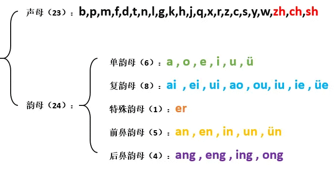
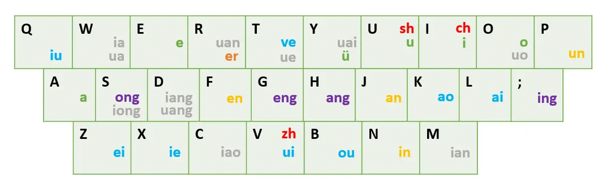
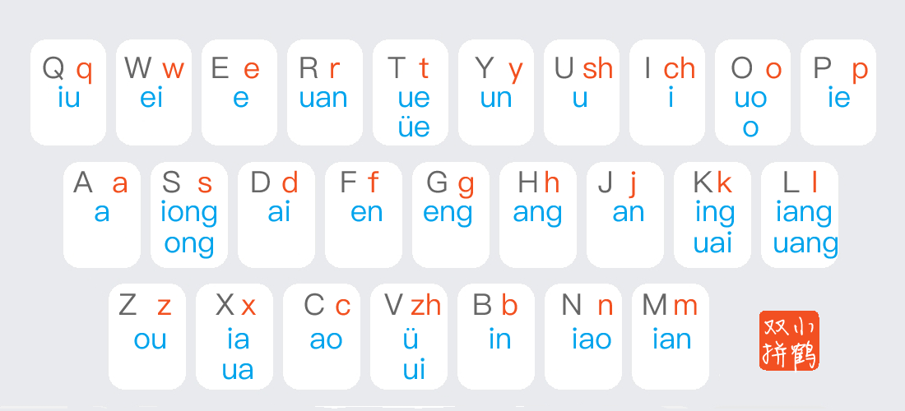

按照我学习的曲折经历来展开后文吧。

## 搜狗双拼

搜狗双拼是用定义好的单字母代替较长的多字母韵母或声母来进行输入的一种方式。例如： 如果 `T=t`，`M=ian`，键入两个字母 `TM` 就会输入拼音 `tian`。使用双拼可以减少击键次数，但是需要记忆字母对应的键位，但是熟练之后效率会有一定提高。

官方网站：[双拼 - 搜狗输入法](https://pinyin.sogou.com/help.php?list=3&q=4)

### 输入规则

**声母**：

```text
ch=I sh=U zh=V
```

**韵母**：

```text
ai=L an=J ang=H ao=K ei=Z en=F eng=G er=R ia=W ian=M iang=D iao=C ie=X in=N ing=; iong=S iu=Q ong=S ou=B ua=W uai=Y uan=R uang=D ue=T ui=V un=P uo=O v=Y ve=T
```

**零声母音节的韵母**：

```text
a=OA ai=OL an=OJ ang=OH ao=OK e=OE ei=OZ en=OF eng=OG er=OR o=OO ou=OB
```

下面只做简单的分类，方便键位的记忆，并不完整。



### 键位图

下面是搜狗双拼键位排列：



### 记忆口诀

#### 基础版

把口诀和键盘结合，可以得到如下记忆标志：

秋娃丫娥远观月 域外舒驰噢卧云昆

阿勇送，汪洋分 更航岸靠来

贼缷邀追 怄您眠

**解释**：

Q 秋 W 娃丫 E 娥 R 远观 T 月 Y 域外 U 舒 I 驰 O 噢卧 P 云昆

A 阿 S 勇送，D 汪洋 F 分 G 更 H 航 J 岸 K 靠 L 来

Z 贼 X 缷 C 笑 V 追 B 怄 N 您 M 眠

> 以上文字属于转载，我在寻找记忆键盘的口诀的时候，见到有人贴出的这个口诀操作性很强就拿来试用，效果可观，这样键盘的记忆就变得轻松的多了

#### 改进版

秋娃丫，额软儿，越域外，书痴我晕；

阿怂恿，汪洋愤，更航安，考来应；

贼邪要，追殴您焉。

**解释**：

Q(iu)秋W(ua/ia)娃丫，E(e)额R(uan/er)软儿，T(ve)越Y(v/uai)域外，U(sh/u)书I(ch)痴O(uo/声母空)我P(un)晕；

A(a)阿S(ong/iong)怂恿，D(uang/iang)汪洋F(en)愤，G(eng)更H(ang)航J(an)安，K(ao)考L(ai)来;(ing)应；

Z(ei)贼X(ie)邪C(iao)要，V(zh/ui)追B(ou)殴N(in)您M(ian)焉。

> 白话赋意：额娘的软弱儿子秋娃跑到域外去了，我晕；都是因为怂恿大愤怒，为了更安全的飞回，只有通过考试应对，小贼要追打您呢。

## 小鹤双拼

~~因为搜狗双拼不太流行且部分平台支持有限，~~ 学习一段时间后我跳槽到小鹤双拼了。小鹤在左右手平衡上做的较为出色，且按键频率上有所优化，保持较高的均匀度，体验最好。

官方网站：[小鹤音形](https://flypy.cc/)

以及快速在 Windows 默认输入法上启用：[Win10 微软拼音添加小鹤双拼以及其他配置](https://ifttl.com/add-flypy-to-win10-microsoft-pinyin-and-other-configuration/) (Windows 10 亦可)

这里贴一下代码：

CMD Ver.

```cmd
reg add HKCU\Software\Microsoft\InputMethod\Settings\CHS /v UserDefinedDoublePinyinScheme0 /t REG_SZ /d "小鹤双拼*2*^*iuvdjhcwfg^xmlnpbksqszxkrltvyovt"
```

PowerShell Ver.

```pwsh
Set-ItemProperty -LiteralPath 'HKCU:\Software\Microsoft\InputMethod\Settings\CHS' -Name 'UserDefinedDoublePinyinScheme0' -Type String -Value '小鹤双拼*2*^*iuvdjhcwfg^xmlnpbksqszxkrltvyovt'
```

### 输入规则

使用两个字母对汉字进行编码的方案，第一个字母表示声母，第二字母表示韵母，没有声母时用零声母代替 单字母声母韵母键位不变，双字母声母和多字母韵母位置见“双拼键位图”

> **零声母方案**：
>
> 指全拼中无声母的韵母音节在双拼中的处理方案，用来充当其声母的字母即零声母。本方案以韵母首字母为零声母，即把韵母的首字母当作声母
>
> - 单字母韵母，零声母 + 韵母所在键，如： 啊＝aa 哦=oo 额=ee
> - 双字母韵母，零声母 + 韵母末字母，如： 爱＝ai 恩=en 欧=ou
> - 三字母韵母，零声母 + 韵母所在键，如： 昂＝ah
>
> 简单说：双字母音节保持全拼方式，一三字母音节为首字母加韵母所在键

### 键位图



### 记忆口诀

官方版的就够用了：

Qiu Wei Ruan T_ue_ve Yun U_shu I_chi

秋 闱 软 月 云 梳 翅

Song_iong Dai Fen Geng Hang J_an

松　拥 黛 粉 更 航 安

Kuai_ing Liang_uang Zou Xia_ua

快　莺 两　望 奏 夏　蛙

Pie Cao V_zhui_v Bin Niao Mian

撇 草 追　鱼 滨 鸟 眠

## 自然码双拼

Y和B按键用得较多，纯双拼情况下打字容易累。故弃坑。

## 练习

说来惭愧，学了好几次，一直没能坚持下来。希望这次写文章能激励我坚持下来吧。嗯，贵在坚持。

一般来说，两小时背下规则，两周熟练打字，一个月恢复甚至超越原来的速度。

文章后续会继续更新笔者的体验和进度（本篇文章全程使用小鹤双拼码字）。

### 练习网站

- 最好用最好看的：[纸砚](https://ninglo.github.io/shuangpin/#/) （顺带一提它还开源，地址就是这个 GitHub 链接）
- 可自定义程度最高的：[keySpell双拼在线练习](https://www.keyspell.top/)

### 记录

2025-05-19


基本恢复正常打字速度了。不容易不容易
