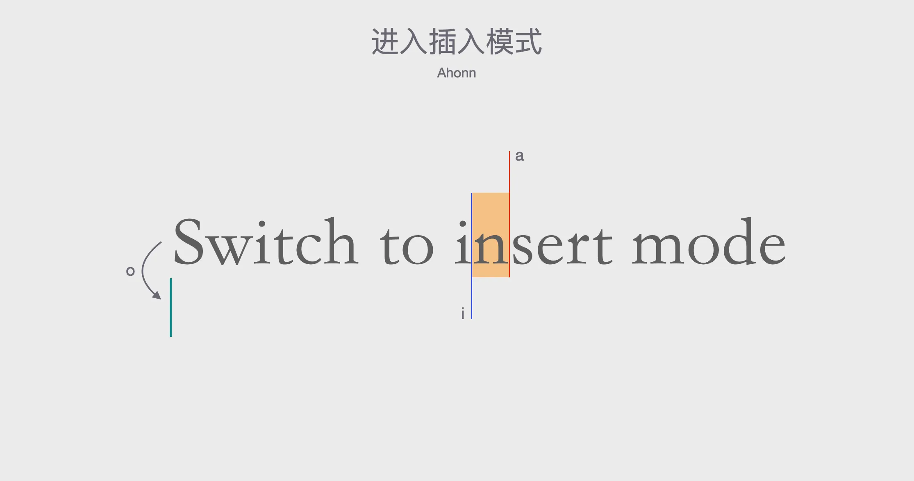
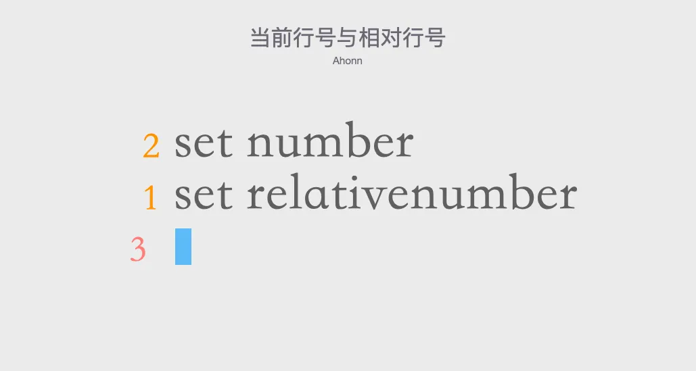

从第一次尝试使用 Vim，到现在不管啥环境都要装个 Vim 插件，也差不多有三年多了。正如俗话所说“万事开头难”嘛，我和大多数的 Vim 初学者一样，也遇到了一段别扭且艰难的学习期。不过好在 Vim 已经让我尝到了一些甜头，这最终使我习惯并喜欢上了这套“反人类”的编辑逻辑。所以这一期就来总结一下 Vim 的一些键位知识，也可以当成教程学习学习。

此外关于我个人的使用上，在用 NeoVim、VSCodeVim 以及 IdeaVim，三家都很好用。不过目前我还只打算开源 NeoVim 的配置，有兴趣的可以看看我的配置仓库：[CWorld NVim Config - Github](https://github.com/cworld1/nvim-config)

## 最基础的内容

### 简单的光标移动

首先是最基础的光标移动。你可能会发现基础的上下左右还能用，但请保持习惯，除了编辑模式下一般不要去碰它。

- 上：`k`
- 下：`j`
- 左：`h`
- 右：`l`

食指作为更加灵活的那个手指，放在下移光标上，能够更频繁敏捷地持续下移光标。

### 简单的开始输入

进入输入模式：

- 向光标位置输入：`i` (insert mode)
- 向光标后一个字符的位置输入：`a` (append)
- 从这一行开头位置输入：`I` (insert at eol)
- 从这一行末尾位置输入：`A` (append at eol)
- 单独向下创建一行输入：`o` (open below)
- 单独向上创建一行输入：`O` (open above)

> 还有冷门的：
>
> - `s` 删除当前字符并进入输入模式（等价于 `cl`，l 即 letter）
> - `S` 删除当前行并进入输入模式（等价于 `cc`）



使用 `Esc`（或 `c-[`）退出该模式。

### 编辑器的常见操作

- 删除一个字符：`x` (delete char)
- 删除前一个字符：`X` (delete backspace)
- 撤销：`u` (undo)
- 返回撤销操作：`c-r` (redo)（意为 Ctrl + r，后同）

### 编辑器的文件基本操作

- 保存：`:w`

  > 强制保存：`:w!`

- 退出当前窗口：`:q`

  > - 强制退出：`:q!`
  > - 退出所有窗口：`:qa`

这样的一个字符命令通常能够连在一起，比如：`:wq`、`:qa!`。输入完命令后记得按回车执行。

## Vim 进阶功能

### 更方便的光标移动

行内跳转：

使用 `w` (next word) 或者 `e` (end word) 向后移动一个词语，其中 `w` 总是会移动到单词开头，`e` 总是移动到单词结尾。任何标点字符都会作为分割。`b` (prev word) 则可以以同样的方式前移。注意这个跳转能跨行。

> `gw` / `ge` 也可以实现回跳，但是两个键也太麻烦了。
> 大写的对应按键也有奇效，但是一般不用，这里不展开。

- 前往行首：0 ("hard" bol)
- 前往行第一个非空字符：^ ("soft" bol)（你也可以用 0 和 w 配合使用达到同样的效果，优点是不用按住 Shift）
- 前往行末：$ (eol)


- 从各种括号的一头跳到另一头：`%`
- 重复执行以便快速移动：数字 + hjkl

  > 默认情况下侧栏的行号总是显示相对的，所以在跳转行时可以看一眼侧栏相对行号快速跳转。大多数 IDE 都支持这个设定。以 Vim 配置为例：
  >
  > ```vim
  > set number relativenumber
  > ```
  >
  > 
  >
  > 此外向下移动光标还有：数字 + 回车。

行外跳转：

- 快速跳转上一个/下一个空行：`{` 和 `}` 。
- 下翻 1/2 页：`c-d`
- 上翻 1/2 页：`c-u`
- 下翻 1/1 页：`c-f`
- 下翻 1/1 页：`c-b`

  > 还有个没啥用的：
  >
  > - 下滚动一行：`c-e`
  > - 上滚动一行：`c-y`

对于全文跳转：

- 前往整个内容顶部：`gg` 或者 `[[` 或者 `:0` 或者 `:1`
- 前往整个内容底部：`G` 或者 `]]` 或者 `:$`

一个很方便的快捷键：

- 将当前编辑行置于视图中间：`zz`

### 快速地选择内容

进入选择模式：

- 正常选择（Visual）：`v`

  > 按下时你就已经选择了当前的一个字母。

- 行选择（Visual Line）：`V`

  > 按下时你就已经选择了该行。

- 块选择（Visual Block）：`c-v`

使用 Esc 退出该模式。


### 更多样地选择内容

进入选择模式后，你可以使用正常的光标移动技巧，以及一些更加灵活的选择方式。这种方式被称作 “文本对象（text object）”，能够让我们不移动光标的情况下来操作一定区域内的内容。

- 选择单词（从光标到下一个符号/空格，包括符号）：`w` (word)
- 选择当前单词：`iw` (in word)
- 选择当前单词（包括下一个符号/空格）：`aw` (around word)
- 选择到下一个对应字符：`f<char>` 或 `t<char>`

  > 同理，可将 `w` 换成别的，比如：
  >
  > - 字母 `l`（letter），使用时需要重写，如 `yll`。个人更倾向于使用 `vy`
  > - 大写单词 `W` (WORD)
  > - 以逗号句号感叹号等收尾的句子（没有的话就是全段了）：`s` (sentence)
  > - 行：`L`
  > - 以空行间隔开的段落：`p` (paragraph)
  > - 引号：`'`、`"`、"``"
  > - 括号：`()`、`[]`、`{}` 等。

### 修改内容

仅修改当前光标所在的这一个字符：`r` (replace mode)

> 进阶玩法：配合选择模式，先选择内容，再使用 r，可以替换选择范围内的所有内容为新字符。

一些必须要配合的命令：

- 修改选择内容并进入 insert 模式：`c` (change)

  > 可以先选择内容后使用，也可配合选择一起使用，如 `ciw`、`cap`、`c3j` 等。
  >
  > 修改本行内光标后的所有内容可用 `C`

- 删除选择内容：`d`（delete）

  > 使用方法同上，如 `diw`、`cap` 等。不过如果是先选择后删除的话，`x` 也是一样的（Vim 特色之都可以实现）。
  >
  > 删除本行内光标后的所有内容可用 `D`

- 复制选择内容：`y` (yank)

  > 复制本行也可以用 `Y`

- 缩进选择内容：`>` 以及反缩进 `<`。这个命令可以重复表示缩进/反缩进多少格，如：`v3>` 表示当前行缩进一格，`>3>` 或 `3>>` 表示接下来三行都缩进一格。

此外还可以：

- 重复输入两次以便快速使用，效果为作用于该行整行，相当于 V + 对应命令。目前已知的命令包括：`cc`、`dd`、`yy`、`>>`、`<<`。
- 搭配数字实现对于多少汗的重复，如 `y3y`、`3yy`。已知可用的命令同上。


### 复制与粘贴

在你进行复制、字符替换、删除、选择修改、覆盖粘贴时，均会将原作用内容同时复制到你的剪贴板。

这个剪贴板是独立于你的操作系统的，你可以通过下面的配置将其连接：

```vim
set clipboard+=unnamed
```

粘贴命令：

- 当前位置后面粘贴内容：`p` (paste after)
- 当前位置前面粘贴内容：`P` (paste before)

> 通常是你在复制整行后，粘贴时注意粘贴位置在前或后会比较方便。
>
> 当你选择了部分内容时，本次粘贴会覆盖选择内容（当然正常编辑器都是这样）。

## Vim 深入功能

### 行内跳转

- 跳转到行内下一个字符：`f` + 跳转字符 (find char)
- 跳转到行内上一个字符：`F` + 跳转字符 ("back" find ch)

> 以及：
>
> - 跳转到行内下一个字符（但是光标往前挪一个）：`t` + 跳转字符 (find char)
> - 跳转到行内上一个字符（但是光标往后挪一个）：`T` ("back" find ch)
>
> 但是不知道有什么用。？

> 

可配合 `c`、`d`、`y` 命令。使用 `;` 可以持续执行上面说的这个跳转操作，只要当前 buffer 没有被关闭就能一直保存跳转字符的记录，随时可用。而 `,` 则做相反方向的查找。

### 查找

- 向后优先查找内容：`/` + 对应内容。输入回车后启用查找模式。
- 向前优先查找内容：`?` + 对应内容。

> 一些相关的 Vim 配置：
>
> ```vim
> " 在输入搜索时逐步匹配并高亮显示匹配的文本
> set incsearch
> " 在搜索时忽略大小写
> set ignorecase
> " 将搜索匹配的文本高亮显示
> set hlsearch
> ```

注：

- 使用 `n` (next) 或 `N` (prev) 跳转所有匹配项。
- 使用 `#` (prev ident) 和 `*` (next ident) 跳转要求更严格，要求每次出现的前后为空白字符或标点符号。不过这两个键还担任了一个小功能：选择想要查找的文段，然后按下这两个的一个就可以快速启动查找。
- 查找支持正则表达式，例如 `/vim$` 匹配行尾的 "vim"。需要查找特殊字符需要转义，例如 `/vim\$` 匹配 "vim$"。
- 如果你不喜欢默认忽略大小写，但是有时候又想用，可以尝试在查找模式中加入指令：`\c` 表示大小写不敏感查找，`\C` 表示大小写敏感查找。如：`/foo\c`
- 高亮显示匹配内容当然很棒！但是取消高亮命令 `:nohl` 就很不方便了。我一般的解决方案是：

  ```vim
  nnoremap <Esc> :nohl<CR>
  ```

  将这个命令映射到 Esc 键。

### 替换

`:s`（substitute）命令用来查找和替换字符串。语法：

```shell
:{作用范围}s/{目标}/{替换}/{替换标志}
```

作用范围：

- 指定行：如 `5s`、`+2s`。`.s`表示当前行，可省略为`s`
- 指定行到行：如 `5,12s`。结合起来使用就可以表示接下来/这之前多少行，如 `.,+2s`
- 全文：`%s`
- 选择模式下选择范围内：`'<,'>s`（选择模式下 Vim 会帮你补全关键字）

替换标志：

- 不写则只替换第一个。
- 全局替换：`g`
- 手动提示确认：`c`

  使用后会有提示：`replace with bar (y/n/a/q/l/^E/^Y)?`

  其中 `y` 表示替换，`n` 表示不替换，`a` 表示替换所有，`q` 表示退出查找模式，`l` 表示替换当前位置并退出。`E` 与 `Y` 是光标移动快捷键。

- 大小写敏感：`i` 表示大小写不敏感查找，`I` 表示大小写敏感。如：

  ```shell
  :%s/foo/bar/i
  # 等效于搜索模式中的\c（不敏感）或\C（敏感）：
  # :%s/foo\c/bar
  ```

> 上述替换标志可以结合使用，如 `:%s/foo/bar/gc`

<!-- ### 文件操作

将当前文件中的第 3~9 行复制并写到新文件 f01 中：[ :3,9w f01 ] -->

## Vim 特色功能

### 实用小功能

- 跳转到指定行：`:` + 行号

  > 或者使用行号 + `gg`（Vim 特色之都可以实现）

- 转置字母大小写：`~`

  > 也可以通过选择以后按 `u` 改为小写、`U` 改为大写实现（Vim 特色之都可以实现）
  >
  > 也可以使用 `g` 这个转置，将 `gu`、`gU` 或者 `g~` 与选择操作拼接起来。

- 数字增减：自增为 `c-a`，自减为 `c-x`

  > 快速生成数列可以使用 `:put=range(0,10,2)`，好像语法跟 Python 是一样的。最后一个参数为 1 时可省略。
  >
  > 此外这个增减不仅可以适用于数字，还可以是八进制、十六进制、bin 和 alpha（我们 Vim 玩家真是增增又减减啊）

  后文还有讲多行递增/递减。

- 内容排序：`:sort`。反向排序使用 `:sort!`

  可以结合作用范围使用：如 `:3,16sort`。该功能可能在 CSS 属性排序很好用

  > 此外还有：
  >
  > - 删除重复行：`:sort u`
  > - 仅使用数字排序 `:sort n`

- 多光标：使用 `c-v` 进入 Visual Block 模式，将光标选中移动到指定位置后：
  - 同时在每行选择内容开头插入：`I`
  - 同时在每行选择内容末尾追加：`A`
  - 同时编辑：`c`
  - 同时删除：`d` 或者 `x`
  - 同时修改为同一字符：`r`
  - 数字递进自增/自减：先选中数字列，`g`，然后 `c-a` 或者 `c-x`

- 合并行，将下一行或者选中行通过空格连接，而不是回车：`J` (join)

  > 如果你不喜欢空格可以用 `gJ` 转置。

- 关闭自动换行后的“行内”上下移动光标：`gk`、`gj`

- 删除行：`:{作用范围}g/{包含关键词}/d`

  反选删除行：`:{作用范围}g!/{关键词}/d` 或 `:{作用范围}v/{关键词}/d`

  大部分时候结合正则可能更好用，如：`:g/^\s*$/d` 表示删除空白行

### 实用大功能

实在太先进了，极大提高你工作效率的独家秘技，所以我要叫它“大功能”（乐）

- 标记：`m` + 自定义字母 (mark)

  之后使用 ` + 自定义字母跳转到标记。

- 宏录制：`q` + 自定义字母 (record macro)

  再按一次 `q` 结束。之后使用 `@` + 自定义字母播放录制的操作宏。可配合数字实现重复执行播放。

## 最后的话

嗯... 文章有亿点长了。如果实在不喜欢记这些东西，并且真的感觉 Vim 很反人类的话，建议停止尝试。适合自己的才是最好的。

最后给点自己觉得还不错的资料：

- [Graphical vi-vim Cheat Sheet and Tutorial](http://www.viemu.com/a_vi_vim_graphical_cheat_sheet_tutorial.html)：Vim 一图流

  

- [Learn Vim (the Smart Way)](https://github.com/iggredible/Learn-Vim)：这是一本非常好的开源的 Vim 入门书籍，它会带你从 Vim 的基础操作，到 Vim 的高级操作，再到 Vim 的插件开发
- [Vim Adventures](https://vim-adventures.com/)：相对有趣的 Vim 游戏，能不那么枯燥地带你一步步的学习 Vim 的基础操作

鸣谢：

- [Yuexun：写给 VS Code 用户的 Vim 入坑指南](https://yuexun.blogit.io/the-vim-guide-for-vs-code-users)
