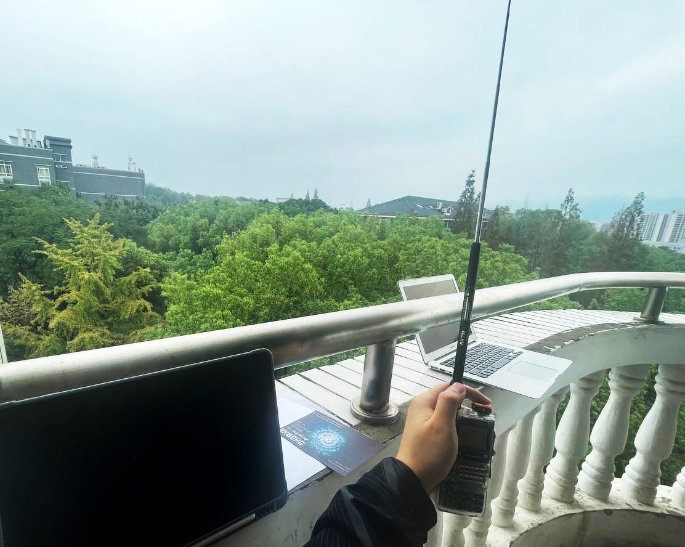
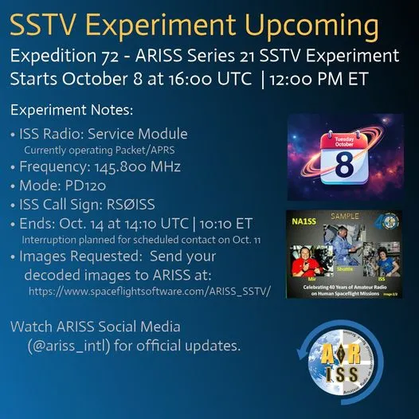
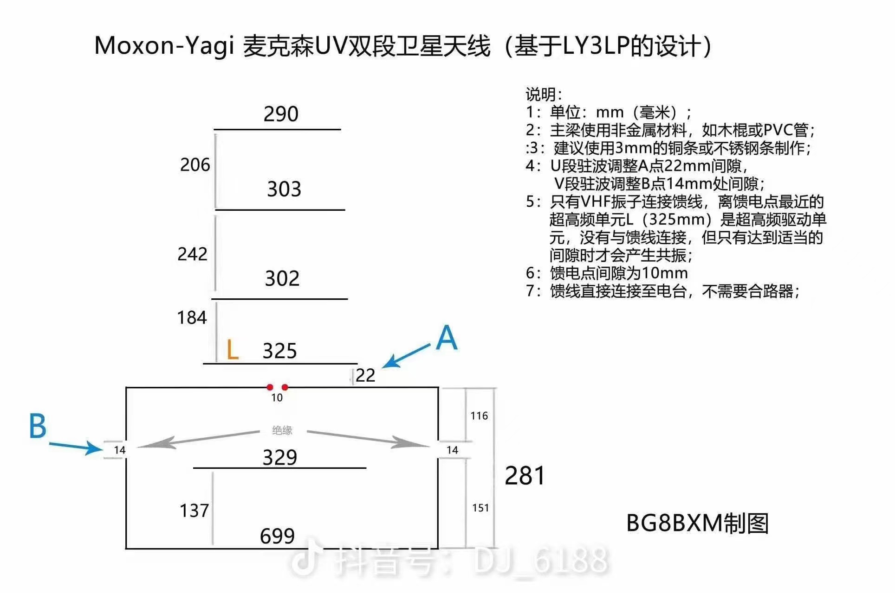
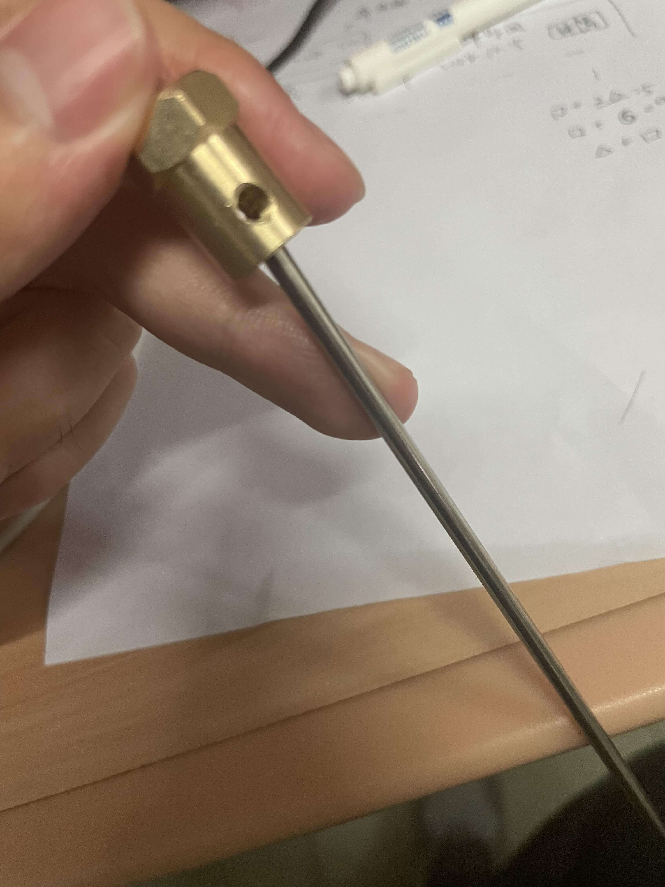
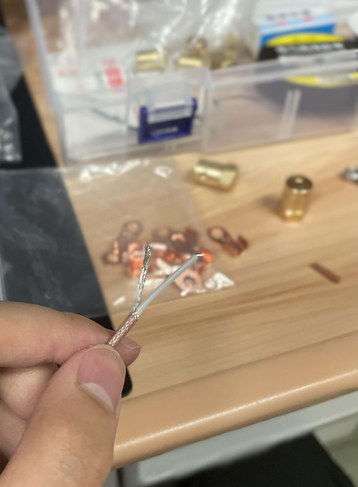
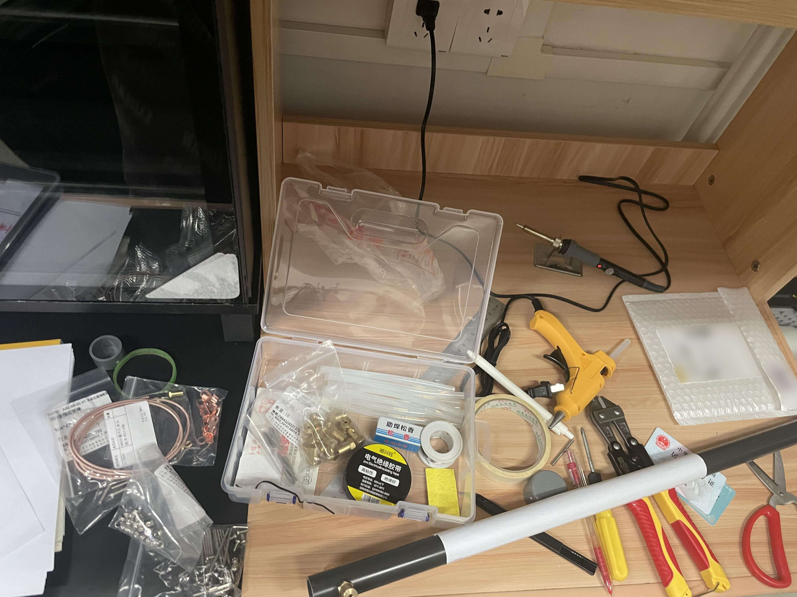
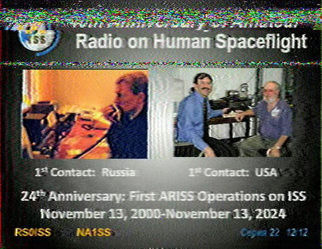
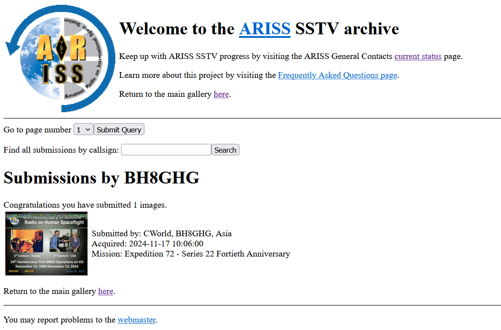
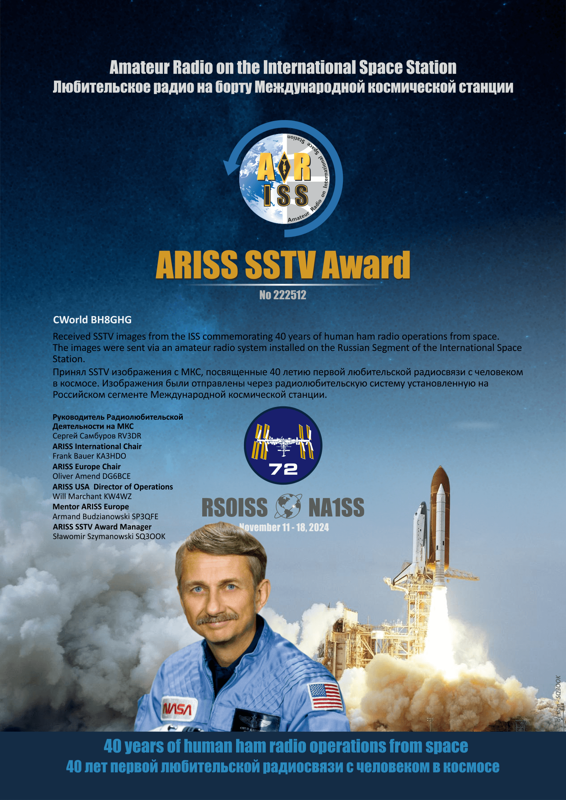

## 前戏

那是 10 月 12 日一个风平浪静的下午。在提前查阅卫星 ISS (Zarya) 会按时过境、仰角七十多度后，我准时掏出了我的电脑解码器、手台和那根被寄予厚望的 Rh795 天线，满怀期待地守在顶楼阳台，等待这次 ISS 活动的最后一次良好的 SSTV 窗口期。

那是一次还蛮有趣的 SSTV 接收活动，8 号一直持续到 14 号，而且时间正正好好，我有足够的时间去调整我的设备、位置和多普勒模式。

然后...就没有然后。多普勒模式 s2，常规模式 s3 杂音，啥也没有接收到。转头看交流群，各大 Ham 早已各显神通，用优良的装备接收到了一张张格外清晰的图片。无奈之下，我又打开了尘封大半个月的淘宝，暗暗下定决定一定要把八木天线手搓出来。隧有此文。

## 理论

理论主要就是图了。

细节制作建议参考 [自制八木天线系列](https://www.bilibili.com/video/BV1Un4y1d738/) 视频，讲的很详细，很多材料都是参考他的。

## 进货

选购过程实在是一波三折，这里感谢 BG8LNG 的指导付出。作为学生实在没有什么趁手的现成工具，只能啥都写进清单购买，要是读者有部分零件一定会比笔者这里便宜不少。先给出一个参考：

其中核心东西：

- 304 不锈钢棒：3mm 是很多前辈试验出来的比较好的直径。
- 螺纹牙棒：固定联轴器 & 拆分光杆，顺带起到方便拆卸收纳的作用。如果你觉得都可以一根光杆嗦到底也可以省掉。
- SMA 单边连接跳线：老 Ham 指出 1 米长度绰绰有余，自信的话也可以买短一点，不过宽边窄用，个人建议新手买满 1 米（你根本不知道你的需求是什么）
- PVC 管：这里分成两部分，一来是方便收纳，二来是拆分后下半可作为 U1V2 八木天线使用。推荐使用 32mm + 25mm 直径，注意还需购买变径转接头，以及为了美观建议购入两端的堵帽塞头。

你有的话可以省掉买的东西：

- 螺母 & 铜鼻子：连接牙棒和馈线，需要配合螺纹牙棒使用，否则只能直接紧焊到光杆上。
- 电焊笔：焊接馈线。
- 热熔胶枪：固定你想固定的东西 & 馈线裸露部分绝缘处理。
- 电工胶布：固定 & 绝缘。
- 美工刀：裁切 & 给 PVC 管打孔（待证实）。
- 断线钳：商家帮忙加工价格甚至轻易超过这位工具本身，老老实实自己买自己搞吧。

感觉不是很有必要但是有更好的东西：

- 电钻：舒适打孔。
- 钻台：这位更是顶级精确。
- 万用表：测量馈线联通情况、阻抗等数据。

最后还有天分（天线分析仪/矢量网络分析仪），目前主流是 NanoVNA，一般价格在两百左右，并且有点容易吃灰，建议去其他 Ham 那里借用。

## 制作

制作确实挺难一帆风顺...遇到了如下问题 & 解决方案：

1. 开孔：起初用剪刀打孔，后来因为过分费力，直接用小电烙下手了。一般一轮只能打一到三个洞，每轮打孔后冷却后需快速清理。总体还算凑合。
2. 钢丝杆：应该比联轴器小上半毫米，否则插不进去。只能重买（还好这玩意便宜）。
3. 螺纹杆：下半应该采用尺寸更大的款式。不过好像已买的部分本来就不够。
4. 固定：下半方框还是挺难固定的...本来是买了螺母，结果发现买成自锁款式了，没法固定，又只能重买...被坑坏了。光螺母内部拧上不一定够用，建议在左右两端间隔处加额外东西固定。

先不说了，上几张图：

↑ 这样才合适的光杆粗细

↑ 辛辛苦苦打磨的合适管长、使用纸筒定位两端对应打孔

↑ 剥掉皮处理后的馈线

↑ 正在制作中混乱的桌面

## 结果

结果当然是大获全胜了😉

已经上传到 [ARISS SSTV 官网](https://ariss-usa.org/ARISS_SSTV/)，被永久保存下来了：

当然伴随的还有一个还蛮帅的证书：

（什么？你问我为什么只发了这些？只是因为常住地天台不打开罢了，或者恰好在开活动的时候忙罢了，或者我回老家不方便带回去罢了）

综上，买材料踩坑不少，希望对读者有所帮助，选购少踩坑~
