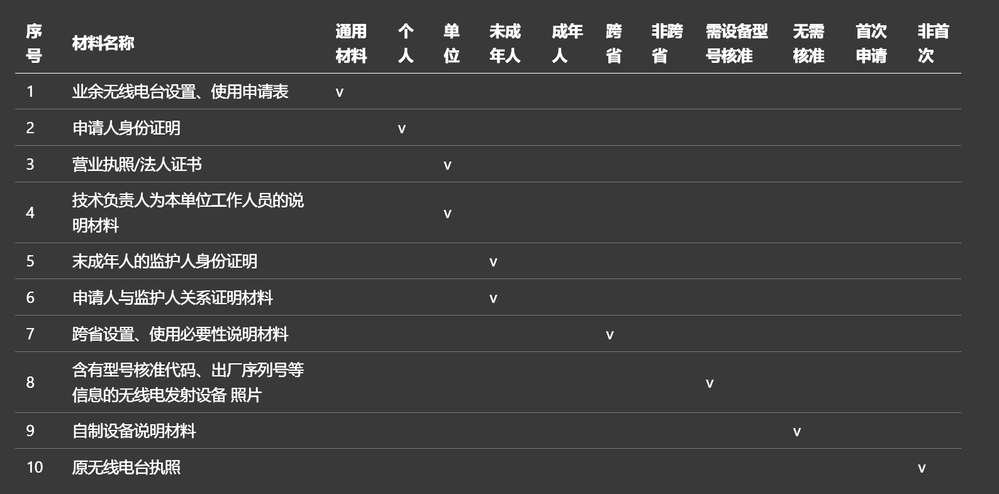

import Collapse from '@/components/Collapse.astro'
import LinkPreview from '@/components/LinkPreview.astro'

## 简介

引用 [Wikipedia 的定义](https://zh.wikipedia.org/zh-hans/%E4%B8%9A%E4%BD%99%E6%97%A0%E7%BA%BF%E7%94%B5)：

> 业余无线电（英语：Amateur Radio），也被称作火腿电台（英语：ham radio）是一种供业余无线电爱好者进行相互通信、无线通讯技术实验、自我训练、个人娱乐、无线电运动、竞赛以及应急通信的一项使用无线电频率频谱的无线电业务。其中“业余无线电爱好者”指“经正式批准的、对无线电技术有兴趣的人，其兴趣纯系个人爱好而不涉及谋取利润”。业余无线电与商业广播、安全业务无线电或者其他专业双向无线电业务存在区别，业余无线电并非这些专业无线电业务的业余形式，也不是有关这些业务的业余爱好，而是一项独立的无线电业务。

业余无线电爱好者中的“业余”，并不是不专业的意思，而是不涉及营利，电台操作需要考取对应的操作证（大部分地区免费考取）、电台执照（无线电管理局核验操作证颁发）。

提供几个生活中常见的关键词会有一个大概的了解：对讲机、短波电台、摩尔斯电码、卫星通联、国际空间站...

目前国内的业余无线电爱好者，大约有 20 万人，是一个相对小众的群体，有趣的是，这项爱好可以扩展很多技能点，结交电波上的朋友。

如果你想深入了解的话，推荐看这个视频：[【不止游戏】一个视频教你取得无线电执照！](https://www.bilibili.com/video/BV1HG4y1j79t)

或者这个文章：[在公园玩业余无线电，我被当成是“间谍” ](https://mp.weixin.qq.com/s/C0RA5xUVByLlEJcklNRo5w)

## 导航

公开社区：

- [HamCQ 社区](https://forum.hamcq.cn/)
- [HelloCQ 论坛](https://www.hellocq.net/)
- [中国业余无线电论坛](http://bbs.cqcqcq.com/)
- QSL 卡片交换：[QRZ](https://www.qrz.com/page/qsl.html)

Wiki 百科类：

- [HamCQ 手册](https://docs.hamcq.cn/)
- [无线电基础](https://www.yuque.com/ham/base)

工具：

- 微信小程序：业余无线电工具集（中继查询更新非常及时！）
- [快点 Ham 工具箱](https://ham.quickso.cn/)
- [CTFever](https://c5r.app/) 工具箱（略硬核）
- 中继查询：[1](https://forum.hamcq.cn/relay)
- 梅登黑德网格定位系统：[1](https://ham-dev.c5r.app/maidenhead-grid)、[2](https://qth.quickso.cn/)、[3](https://liunan.github.io/crac/locatecode.html)（论大伙为什么这么喜欢重复造轮子）
- APRS 地图：[1](https://aprs.tv/)、[2](https://aprs.fi)
- [业余无线电卫星数据库](https://ham-dev.c5r.app/satellites)

书籍 & 正式文档（非深入学习不推荐）：

- [业余无线电通信（第五版）](https://huangenet.lanzoub.com/i3hlV17yi3rg)
- [HamStudy](https://hamstudy.org/)

## 考试

既然都有证书一说，那考试是必然少不了的。作为初学者，只能选择 A 类，具体报名参考各省/直辖市的官网或官方公众号。一般会提前一个月在平台上发公告，微信公众号可能会更容易跟进一些。

### 准备资料

准备考试推荐从这篇帖子开始：[中国 A 类业余无线电台操作证快速复习指北](https://www.jimmytian.com/archives/crac-aro-licence-a-review-guide.html)

然后是这个非常全面的文档：[Github - Ham-license-type-a](https://github.com/jks-liu/zhihu/blob/master/ham-license-type-a.md)

如果不自信可以看看这个 [考试题库解析](https://ham-dev.c5r.app/crac-question-bank)

学完后可以直接上真题：

- [业余无线电模拟考试平台](https://www.cqid.cn/)
- [官方题库下载地址](http://www.crac.org.cn/News/List?type=6&y=)
- 智谱APP练习：[iOS: App Store](https://apps.apple.com/cn/app/%E6%99%BA%E8%B0%B1/id1448978640) | [Android: Offical Site](http://82.157.138.16:8091/CRAC/crac/pages/list_files.html)
- [重庆无线电提供的公益考试模拟](https://wxdks.jjxxw.cq.gov.cn/wxdks/main/mockTest.html)

随便选一种就够了。只要认真花上两三个晚上准备，一般是不会翻车的。

此外我自己整理了一个可能比较广适用的易错题集，有兴趣的可以点击下面的展开列表看：

<Collapse title='易错题集'>

- 对以不正当手段取得业余无线电台执照的，无线电管理机构可以给予下列处罚：

  责令限期改正，可以处警告或者三万元以下的罚款

- 设备电源拔掉电源线以后，检修时还有什么安全风险？

  充满高电压的电容器可能造成电击

- 接收机灵敏度指标数值大小所反映的意义是：

  灵敏度指标数值越小，接收最小信号的能力越强

- “电台设备”的业余无线电通信常用缩语是：

  RIG

- 下列哪种设备可以用来代替普通的扬声器，可在嘈杂的环境中更好地抄收语音信号？

  耳机

- 在无线电管理中，将无线电频率或频道规定由一个或多个部门，在指定的区域内供地面或空间无线电通信业务在指定条件下使用，这个过程称为：

  分配

- 只包含一个频率分量的信号是：

  简单正弦波

- 无线电管制是指在下列范围内依法采取的对无线电波的发射、辐射和传播实施的强制性管理：

  在特定时间和特定区域内

- 在业余无线电通信中，“驻波比”通常用来衡量：

  负载与传输线的匹配质量

- 430MHz业余频段中留给业余卫星通信使用，话音及其他通信方式不应占用的频率段为：

  435MHz至438MHz

- 我国分配给业余业务和卫星业余业务与其他业务共用、并且业余业务和卫星业余业务作为唯一主要业务的频段的个数以及在3GHz以下的该类频段分别为：

  3个，144-146MHz

- 业余电台的无线电发射设备应符国家规定的下列主要技术指标：

  符合频率容限、符合杂散发射最大允许功率电平

- 无线电波在自由空间中的传播路径损耗遵循下列规律：

  与距离的平方成正比，与频率的平方成正比

- 多径传播对UHF波段或VHF波段数据通信的影响是：

  可能使误码率增大

- 某商品天线说明书给出的增益指标以dBi为单位。其意义为：

  “相对于无方向性点源天线的增益”，即最大辐射方向上的辐射功率密度与理想点源天线的辐射功率密度之比

- VHF业余无线电台在144MHz频段进行本地联络时应避免占用的频率为：

  144-144.035MHz和145.8-146MHz

- 业余电台之间进行通信，必须相互正确发送和接收的信息为：

  本台呼号、对方呼号、信号报告

- A类业余无线电台允许发射的最大发射功率为不大于：

  25瓦

- 业余无线电通信中常用的天线种类的缩写DP代表：

  偶极天线

- 在无线电管理中，将无线电频率或频道批准给具体的业余无线电台在规定条件下使用，这个过程称为：

  指配

- 个人申请设置具有发信功能的业余无线电台的年龄条件是：

  年满十八周岁

- 国际电联规定的确定发射电台辐射功率的原则为：

  发射电台只应辐射为保证满意服务所必要的功率

- “我遇到他台干扰”的业余无线电通信Q简语为：

  QRM

- 我国对无线电管理术语“业余业务”、“卫星业余业务”和“业余无线电台”做出具体定义的法规文件是：

  中华人民共和国无线电频率划分规定

- 业余无线电普遍使用的同轴电缆的特性阻抗是？

  50欧姆

- 决定超短波视距传播距离极限的主要因素是：

  发射天线和接收天线离地面的相对高度值

- “发信机”的业余无线电通信常用缩语是：

  TX、XMTR

- 业余无线电通信中常用的天线种类的缩写VER代表：

  垂直天线

- 俗称的6米业余波段的频率范围以及业余业务和卫星业余业务的使用状态分别为：

  50-54MHz，主要业务

- 以dBd为单位的天线增益则是指：

  最大辐射方向辐射功率密度与半波长振子最大辐射方向辐射功率密度之比的dB值

- 某商品天线说明书给出的增益指标以dBi为单位。其意义为：

  “相对于无方向性点源天线的增益”，即最大辐射方向上的辐射功率密度与理想点源天线的辐射功率密度之比

- 只包含一个频率分量的信号是：
  简单正弦波
- “我的电台位置是××××”的业余无线电通信Q简语为：

  QTH　××××

- 频率容限是发射设备的重要指标，通常用下述单位来表示：

  百万分之几（或者赫兹）

- 业余无线电通信中常用的天线种类的缩写YAGI代表：

  八木天线

</Collapse>

某群友 BH8GCJ-OL39FM/DJ 也给出了一个很好记的口诀：

<Collapse title='易记口诀'>

- 申请设台十八岁，独立操作需要证。
- 闪电电波是辐射，电台杂散是发射。
- 有划分选划分，一个多个是分配，具体电台要指配。
- HVU小到大，单位MHz。
- 50，144为主要，唯一主要144。
- 430-440为次要，主要业务是定导航。
- 145.8-146MHz，435-438MHz两个频段不要占
- 公安，三万，五千，顺序选
- QRZ?谁叫我，M他台，N天电。
- QTH是位置，ANT来是天线，频率后面带EQ，电台设备RIG。
- OM是个老朋友，WX来是天气，73致意加祝愿。
- 收信发信两个词，收发信机带VR。
- DP偶极，GP接地，BEAM定向，YAGI八木，VER垂直。
- 已知北京小于0日期改为前一天，已知UTC大24日期改为后一天。
- EQ分区347，ITU分区有5个。
- 安电流，伏电压，欧电阻，瓦功率。
- KMGT369 12mμnp 均为负。
- 5W 0.25W 0.4kW一百以内数选大。
- 电源电压正到负，欧姆定律正反比。
- 峰峰100三十五，峰值100为70，平均电压都为0。
- dB单位无意义，dBi来找理想，dBd来半波长。
- 信号强弱0.8。
- 同轴电缆50欧，又怕水来又怕潮，使用方便影响小。
- 无线电波光速快，3x10^8米/秒，其他介质小于1。
- 两个组成电，磁场。频率增长波长短，波长要用300除。
- 电池电压1.5，电动势为1.5，碱性电池不能充，失效要用电压档，元件短路电阻档。
- 车载电源12V，微波炉用特高频，嘈杂环境用耳机。
- LED二极管，LCD显示器，交变直流整流器，市电变低变压器。
- 并电压，串电流，测电阻来欧姆表。

</Collapse>

### 考试事宜

笔者是重庆这边考的，故后文根据重庆展开。当然别的地区也可以作为参考。

报名官网：[重庆市业余无线电信息服务系统](https://wxdks.jjxxw.cq.gov.cn/wxdks/index.html)

笔者也是花了两次（第一次有事没法参考）成功拿下了。重庆这边是上机考试，并且上文的 “重庆无线电提供的公益考试模拟” 竟然就和真实上机考试一样，仅多了账号登录和考生展示（算是）。

笔者这里到场后是有人在做无线电相关科普讲座的，后来据行为判断大概率是爱好者做志愿劳动。如果有能力建议提前半小时到场听一些常识性知识，实在不行也能自己刷刷题巩固。

考试一般做题很快，这边是先进去就先做。我上了厕所后进去才登上系统做了几道就有人交卷了。个人建议最好做完后还是要再检查一遍，一来花不了多少时间，二是失败就要等几个月重考。

### 考试趣闻

都提到讲座了，就顺便分享一些内容吧。

- 定位梅登黑德网格：对比经纬度模式的网格定位系统，优点在于简略、精准。定位梅登黑德网格仅需6个字符就可表示，同时精确度可以达到公里级别，误差仅在两到三公里以内。讲座人还分享了一个可以快速查询 [定位梅登黑德网格](https://liunan.github.io/crac/locatecode.html) 网址。

- QSL 名片：除了重要的呼号外，建议附上日期、时间、频率、模式、信号报告、设备、天线、功率等信息，方便对方联系。

  

- 报备准备材料：

  

  表格感觉画的怪怪的（能看就行）

然后现场还开展了小型线下交流会，大佬们驱车架着硕大的天线互相交流。

## 上证

毕竟考试只有选择题，基本都是做完就知道自己有没有考上了，对应的地方网站或公众号也可查询考试结果。

在这段时间，你可以：

- 加入相关组织、群聊、社区，进一步聊天、了解相关知识
- 查询证书编号
- 获取操作证电子版
- 选购心仪的设备
- 提交设备申报、申请呼号

相关组织群聊可以在考试现场找相关爱好者寻求。

### 证书编号

考完第二天一般来说就可以前往 [CRAC](http://82.157.138.16:8091/CRAC/crac/pages/list_cert.html) 查询自己的证书编号了。

### 操作证电子版

电子版仅供说明，即使官方也是使用背景板 + html 拼装的。在地方官方网站的证书电子版出来前，你可以使用模板自己做一个，方便后续申请。这里提供一个 PSD 版本的模板：[Lanzou](https://cworld.lanzoub.com/b02xdn8mve) （密码:ai66）

## 取号

1. 业余无线电台设置、使用申请表
2. 身份证（正反面）、业余电合操作证
3. 含有型号核谁代码、出厂序列号等信息
4. 原无线电合执照（首次申请不需要）

取号要购入设备登记获取。

### 选购设备

这个时效性可能比较强，这里就不多推荐。截至到 24-09-24，泉盛的 uv-k5 和 uv-k6 还是很不错的，推荐扩容版，可以刷自己喜欢的，开源或者不开源的固件。

此外宝峰的不少机型同样值得选购入门。个人建议购入可以刷第三方固件的机型，而其中知名第三方 [OpenGD77](https://www.opengd77.com/index.php) 就包揽了 GD-77, GD-77S, DM-1801, DM-1801A, RD-5R, MD-9600/RT-90, MD-UV380/RT-3S, DM-1701/RT-84 and MD2017/RT-82 机型（貌似有部分机型是特易通等其他品牌），读者可比较后挑出最合适的型号按需购入。（从不知名论坛获得一些主观向数据，dm1701、dm1801、dm5r 是宝峰旗下表现相对更综合优秀的数字对讲机）

### 发送申请

这个地域性也很强，其他地方可以加地域关键词前往各大媒体平台查询，部分官方也会发推文教学。

重庆这边是 [官方推文](https://mp.weixin.qq.com/s/DgXMYGRNLZJRCfIRUE5v5Q) ，B站也有网友投稿的 [视频版本](https://m.bilibili.com/video/BV12Ss8eEE7M) 。建议尽早提交相关申请，避免申请高峰审核较慢，当然也要注意不要误填，审核也是相对蛮严格的。

> 申请时一般要求填写对应设备的 S/N 码、照片等，建议咨询卖家客服，卖家承诺能给你提前拍照提供后再购买。毕竟等快递还得好几天不是。
>
> 除此以外的信息可前往 [核准代码工信部查询](https://ythzxfw.miit.gov.cn/resultQuery) 获取。

### 玩弄设备

笔者当前使用的设备为泉盛 UV-K6 扩容版，并且写了一篇对应的博文：

<LinkPreview id='https://cworld0.com/blog/uv-k6' />

### 空中交流

> 作为HAM，我们首先应该从我做起，自觉的维护良好的空中秩序，自觉的规范通联，自觉的抵制非业余电台的侵入，自觉遵守全世界HAM公认的业余无线电爱好者准则：“体谅、忠诚、进取、友爱、适度、爱国”。

无线电基本通联规则：

1. 守听：在发射前，应先守听频率，确保没有其他电台正在进行通信。
2. 呼叫：进行呼叫时，应使用“CQ”或特定电台呼号，并按照规范的格式报出自己的呼号。例如，"CQ CQ CQ，This is BG1XXX，BRAVO GOLF ONE X-RAY X-RAY X-RAY，BG1XXX calling CQ and standing-by"。
3. 字母解释法：在呼叫时，必须至少一次使用字母解释法来解释自己的呼号，以避免混淆。
4. 信号报告：在通联过程中，应提供信号报告，包括可辨度（R）和强度（S），如“59”表示信号强度和可辨度都很好。
5. 结束语：通联结束时，应使用“73”来表示祝福，然后是“再见”或“OVER”，如“73 and goodbye”。
6. 插入：如果想加入正在进行的通联，应先请求插入，并在得到允许后加入。

> 注：
>
> 1. 频率使用：应避免长时间占用频率，以便其他人也能使用。
> 2. 礼貌：在通联过程中，应保持礼貌和专业，尊重其他电台。
> 3. 遵守法规：确保遵守当地的无线电通信法规和国际电信联盟（ITU）的规定。
> 4. 特殊情况：在卫星通联等特殊情况下，可能需要遵守额外的规则，如调整频率以补偿多普勒效应，使用特定的呼叫方式等。

日常空中交流用的模板：

- CQ、CQ、CQ。BH8GHG 呼叫。Bravo Hotel Golf Hotel Golf 呼叫，BH8GHG 呼叫。听到请回答。
- Xxx，XXX，Xxx。这里是 BH8GHG。Bravo Hotel Golf Hotel Golf，这里是 BH8GHG。听到请回答。
- 插入！Breakin!

报道点名步骤：

- _（等待主控呼叫）_
- 回复主控: 主控主控，这里是 BH8xxx（自己呼号），Bravo Golf Eight xxx，向主控请求请求参加点名 Over。
- _（主控确认呼号）_
- 回复主控：主控抄收正确，这里使用的设备是【品牌、型号】，【型号/原装】天线，【功率】瓦发射，U/V 段频率，我的 QTH 是【区域，地名】，抄收主控信号【59/49/39】，请问主控是否抄收 Over。
- _（主控回复设备、天线、功率、QTH 信息，并回复信号报告询问抄收是否正确）_
- 回复主控：主控抄收完全正确，谢谢主控，【主控点名辛苦/点名顺利】，【也祝友台周末愉快/祝晚间愉快】，我这边就改为守听状态了，73 送上 Over。

<Collapse title='点名主持相关'>

点名开场：CQCQCQ，这里是业余无线电200038频道台网，请各位台友进入南山对讲，房间号200038，现在是2024年（）月（）日星期五，北京时间八点整，每周五晚中继台网例行点名时间，点名时间20:00-21:00，我是今日主控（呼号）我使用的设备是南山链路，QTH（位置），请抄收到中继台网信号的友台有序上台待主控确认后依次报告您的呼号，QTH，抄收主控的信号报告，下面有请第一位友台参加点名。

点名结束：这里是业余无线电200038频道台网每周五例行点名活动，现在是北京时间21:00，截止目前，中继台网已经通联( )位友台，本次中继台网点名活动到此结束，今晚主控（ ），感谢大家踊跃参与，本次云南HAM台网业余无线电中继台网点名活动圆满结束，本房间恢复自由通联状态，本房间恢复自由通联状态，祝大家周末愉快，73，over

</Collapse>

字母解释法对应转换表格（这个 [在线版](https://ham-dev.c5r.app/) 甚至有发音教学）：

| 字母 - 单词 | 字母 - 单词 | 字母 - 单词  | 字母 - 单词 |
| ----------- | ----------- | ------------ | ----------- |
| A - Alpha   | H - Hotel   | N - November | U - Uniform |
| B - Bravo   | I - India   | O - Oscar    | V - Victor  |
| C - Charlie | J - Juliet  | P - Papa     | W - Whisky  |
| D - Delta   | K - Kilo    | Q - Quebec   | X - X-ray   |
| E - Echo    | L - Lima    | R - Romeo    | Y - Yankee  |
| F - Foxtrot | M - Mike    | S - Sierra   | Z - Zulu    |
| G - Golf    |             | T - Tango    |             |

一些常见的简语：

- QSO：直接通联
- QSL：抄收（在通讯中已听明白了对方的内容，可以解释为收到、听到，此外还有QSL卡片，是做为确认通联用的。）
- QSY：改变频率
- QSP：代转
- QRT：电台停止工作
- QRM：受到他台干扰
- QRZ：谁在呼叫我
- QTH：电台位置
- 73：美好的祝福
- 88：爱与吻
- ~~QBG：大冤种（[源自 BD7QBG 小故事](https://hkems-stmo.top/pages/prank/BD7QBG.html)，Ham 聊天喜欢用）~~

### 抄收记录

部分地区会在审发证书的时候寄通讯记录本子，建议提前问老火腿是否提供，如不提供再自己按需打印/购买。这里提一些关于抄收的细节：

- 设备

  主流手台厂商：泉盛、宝峰、泉益通（QYT）、摩托罗拉（Motorola）、特易通（TYT）、八重洲（Yetsu）等。（熟悉主流品牌名可以避免在抄收时尴尬地问对方写法）

- RST 信号报告

  > 摘自 [什么叫QSO、QSL、什么叫倒频、抄收、59、73](https://club.autohome.com.cn/bbs/thread/ccc22b7dad5c62dc/4103298-1.html)

  在话方式的通讯中，联络双方要报告对方的信号可辩度R、强度S，其中：

  - R 分为 1、2、3、4、5 档，1 为信号不可辩，5 为信号完全可辩（需要自己主观判断信号质量，一般好的信号在4和5，信号差就3，比3还差你无法判断的话直接回复对方无法抄收就行）；
  - 设备上的 S 代表场强，S 分为 1、2、3……8、9，分别为信号强度，9 为最强，有些机器上有S表显示，超过9的以+10dB、+20dB等表示（一般设备都会直接展示 S 表直接告诉你）

  如：一个很强的本地台用FM话方式做通讯，信号可能是59，或59+，信号弱一点的可以是58、57等；
  如果是一个很弱的外地台用SSB话方式，信号可能是53，或者你听他的内容都很困难：33、23等；
  如果用电报的方式（CW）还要加上第三位，如599、557等。

  > 错误用法：
  > BG\*\*，这里是BG\*\*\*，QSO？（也许是某人口误，QSL变成QSO，别的初学者也跟着错，我在频率上听得多次了，一次还听到一位BV的电台在苦口婆心地纠正一位BG台。）
  > BG\*\*\*，你的信号五十九，很强！（RST不是个位、十位、百位的关系，报五九就可以了，不要报五十九。）
  > BG\*\*\*，你的信号599！（在FM或SSB等话方式中，RST只报前面的R和S的值，没有T，T是针对CW的。）

### QSL 卡片

成功获得呼号（Calldign）后可以前往 [QRZ](https://www.qrz.com/page/qsl.html) 注册并发布相关内容（笔者的 [QRZ 地址](https://www.qrz.com/db/BH8GHG)）。这样的网站主要用于通过呼号查询电子 QSL、通联记录、联系信息等。

类似的网站还有 [HamQTH](https://www.hamqth.com/)。

你可能需要：[这才弄明白 CQ zone 和 ITU zone](https://www.hellocq.net/forum/read.php?tid=253352)

部分更多内容请移步至进阶篇：

<LinkPreview id='https://cworld0.com/blog/amateur-radio-2' />
