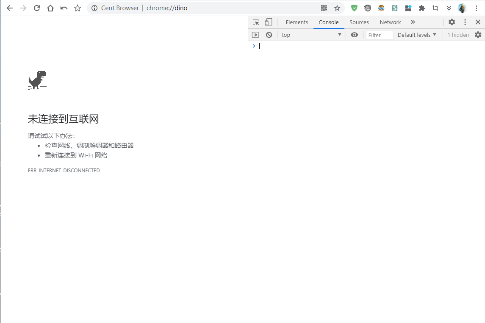
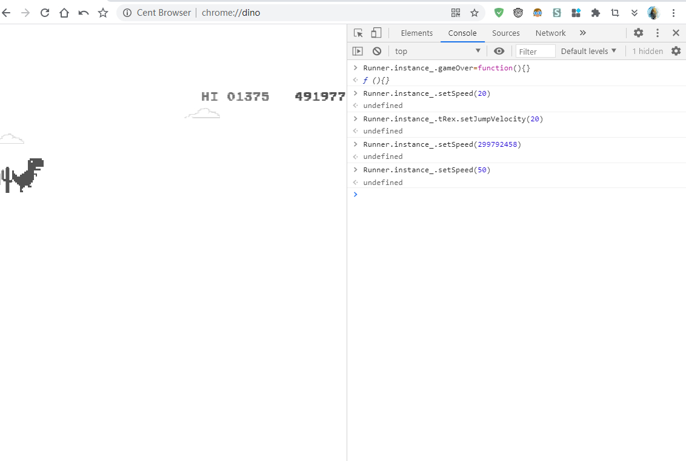

## 前言

众所周知，谷歌的 Chrome 含有一枚彩蛋，是一个~~画风清奇~~的小恐龙游戏，可以通过断网和直接访问一下网址触发：

[Chrome://dino](chrome://dino/)

但是对于这种逐渐加速的小游戏来说，玩到后面就特别容易内心崩溃，于是便有了此文。

## 食用方法

来到熟悉的网页，按下罪恶的 F12：

看到控制台的 Console 了吗？点开就对了。

三行代码，总有你喜欢的：

- 让小恐龙无敌：

  `Runner.instance_.gameOver=function(){}`

- 让小恐龙跑得更快（默认是 10，但是你可以手动修改*使它更快*）：

  `Runner.instance_.setSpeed(20)`

- 让小恐龙跳得更高（默认是 10，但是你可以手动修改*使它更富有弹性*）：

  `Runner.instance_.tRex.setJumpVelocity(20)`

就像这样子：

问我最高多少分？我觉得应该是 999999 分。

## 后话

我觉得，当你无敌后，一种莫名的无聊感觉涌上心头...
