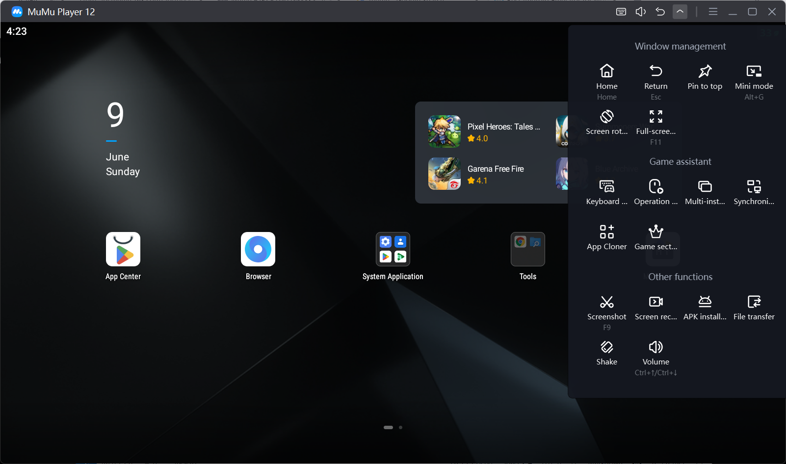
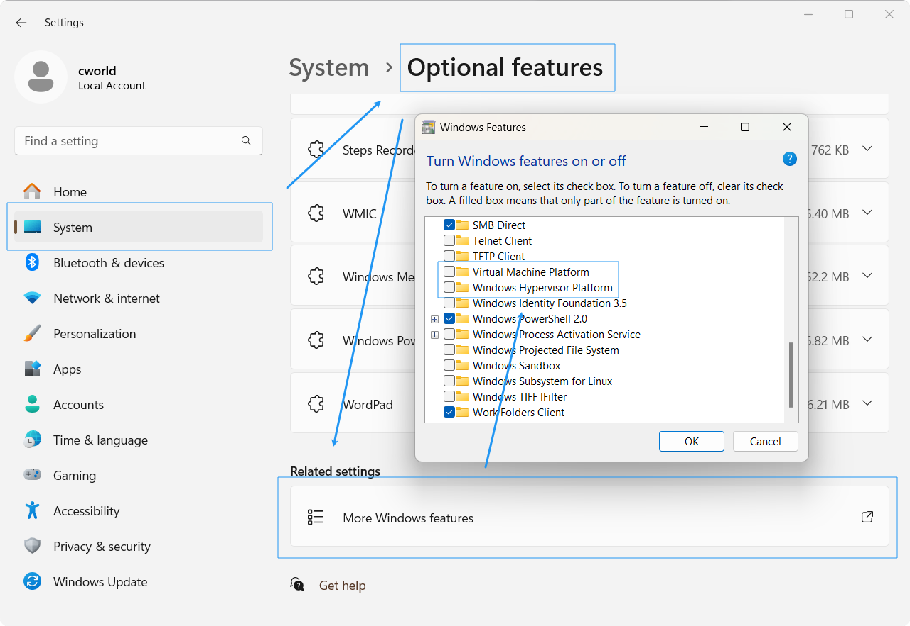
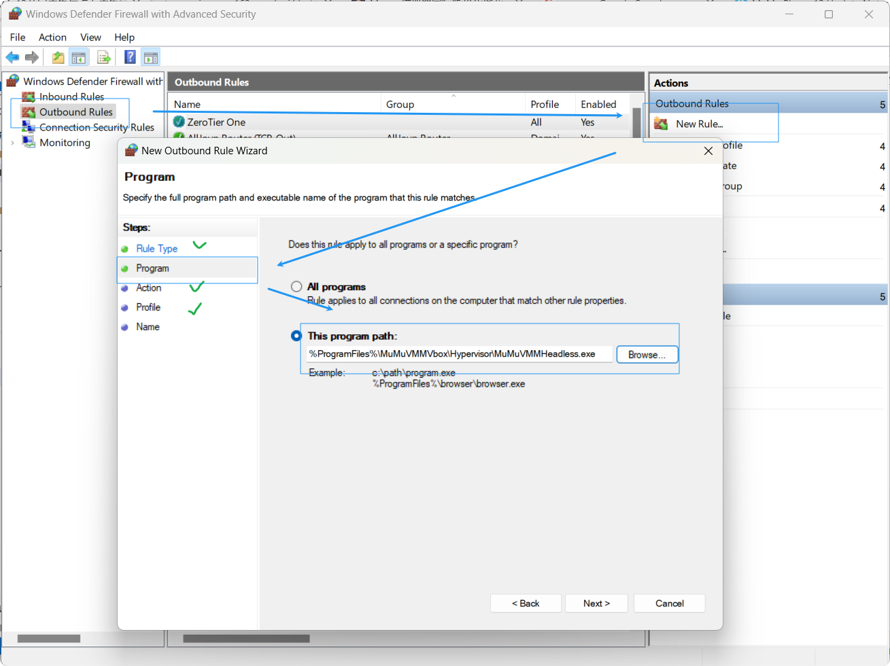
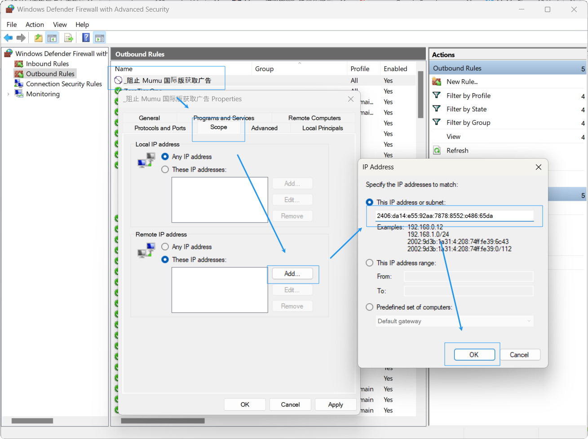

Mumu 国际版地址：[Mumu Player](https://www.mumuplayer.com/index.html)

## 体验

官网好像展示了不少国内手游...不知道是团队没有做本地化还是国内手游崛起了。简单体验下来感觉跟国内版区别不大，该有的功能一个没落下。



开机过程无广告。启动后右上角有一块牛皮藓。上方无搜索框。顶栏右侧无消息中心、无软件专区。主页无换装功能，推荐程序换成了 Chrome 和 Amaze。

应用克隆不确定是不是国际版专属。游戏专区移植来了，但是安静待在箭头小面板里，基本没啥影响。自带的软件商城应该是国际特供专区，仅提供预览功能，有跳转到 Play Store。


自带谷歌四件套，但是系统设置内可停用，不用担心后台反复请求失败耗电了，这点算是非常舒适。


系统设置可以调中文，模拟器本身不清楚，不过能不能都没啥影响了。模拟器设置与国内版完全保持一致，设置内可一键开启 Root（但是游戏玩家请注意，Root 可能会导致某些游戏触发外挂误封、封号等恶劣影响，慎用）。

游戏内快捷键动作、案件映射正常使用，Mumu 国内版早期的导出同样被砍，但是 Mumu 国内版的在线分享和在线导入提示无法使用，估计是需要等后续更新。不过好消息是本地导入依然可用，划火柴之类的进阶操作依然可以从网上下载，并且还能本地微调代码。

与某项目联合的截图增强功能似乎暂时无法使用，公告明确指出 Global 版本不支持，不过这个功能本就是实验性的，大可期待后续更新。

总的来说更加清爽，缺失的小功能大都无关紧要，整体明显更加轻量化，尤其是当你玩的手游有国际服，能够蹭上一些针对性的特殊优化的话，还是比较推荐。

## 优化

1. 首先前往菜单中的问题检测（Problem Diagnosis），你可能需要按提示关闭 Hyper-V。按提示重启后再次检测，应该显示全绿。

   

2. 前往系统的 Windows Security（安全中心），按照图示路径关闭内存隔离，有效提示运行效率。重启生效。

   

3. 使用你喜爱的清理工具清理注册表，残余注册表可能对模拟器运行效率造成一定程度的影响（玄学，但可能有用）。

4. 前往系统设置 - 系统 - 可选功能 - 更多 Windows 功能，使图示两个选项保持关闭状态，避免与 Mumu 发生直接冲突。

   

5. 前往系统设置 - 系统 - 显示 - 显卡，将 Mumu 添加进去，然后按需设置，不会设置可直接选择高性能。

   

6. 加固设定：如果你是 N 卡用户，前往 GeFore Experience / Nvidia App，手动加入到游戏列表，保证一定被 Nvidia 应用优化到。

   

7. 前往 Mumu 本身设置，拉高配置，也可一定程度缓解卡顿问题。

   

此外官网也有一些优化指南，如有必要可作参考。

经过上述一顿操作，重启模拟器，大概已经变得非常丝滑流畅了。设置内帧率显示开启后，除开较为复杂的 3D 场景，应该能稳定保持高帧运转。接下来可能要做一些特殊优化。

## 除藓

> 注：除非你是强迫症，并不是很建议去除广告，这应该是国际版模拟器唯一明显的广告位置了，人家毕竟不是做慈善的，如果去除掉，多少会影响收入来源。

通过提取启动器安装包后，MT 等工具逆向搜索，可发现类 `AppStoreApi` 内含广告 API 接口。


易发现链接 API 对应的 IP 基本固定，故屏蔽 IP 即可。通过终端可获取：


前往 Windows 防火墙（Firewall Defender），添加如图规则，注意对应程序路径，绿色打勾处默认即可：



继续双击规则，在范围选项卡添加对应的拦截远程 IP 地址即可：



IP 可能有变化，建议大家自行测试确认。测试代码：

```shell
ping api.mumuglobal.com
```

截至目前发布文章，获取的 IP 地址为：

```log
2406:da14:e55:92aa:7878:8552:c486:65da
```

> 当然如果你觉得手动添加 IP 太麻烦，也可以采用命令行添加。注意命令中的程序位置、对应地址，且命令行执行需要管理员权限：
>
> ```shell
> netsh advfirewall firewall add rule name="_阻止 Mumu 国际版获取广告" dir=out action=block program="%ProgramFiles%\MuMuVMMVbox\Hypervisor\MuMuVMMHeadless.exe" remoteip="2406:da14:e55:92aa:7878:8552:c486:65da" enable=yes
> ```

## 综述

模拟器现在就 Mumu 和雷电两家最好用了，国际版干净高效，推荐尝试。
