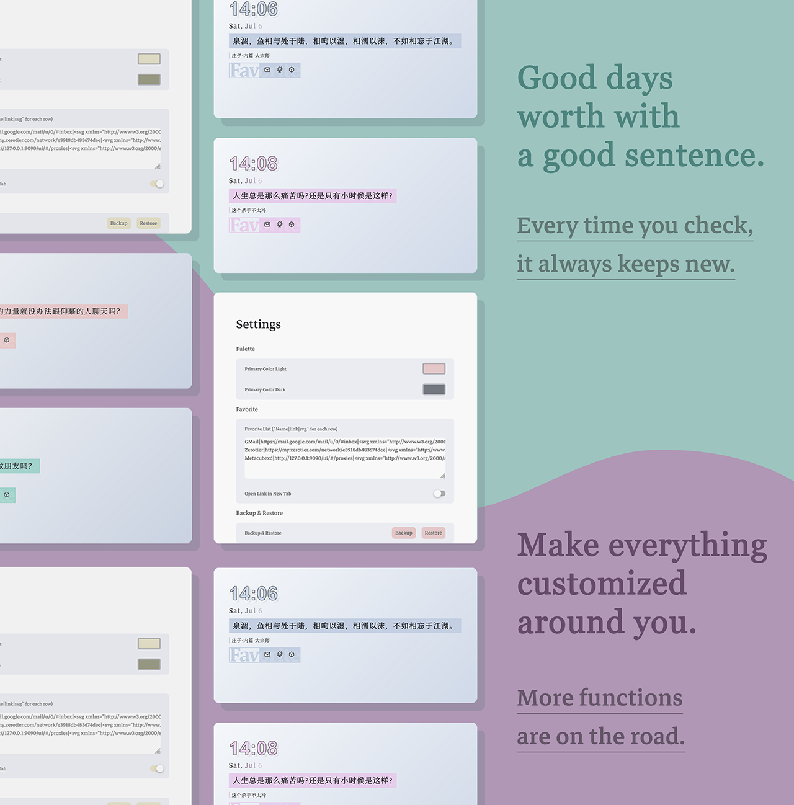

import LinkPreview from '@/components/LinkPreview.astro'

> 前要：最近常常再几个主流浏览器之间徘徊偶尔混用，被各家混乱的新标签页烦恼不已（点名批评 Edge，要么占后台要么加载迟缓甚至闪白屏，体验实在是一言难尽）。加之后面有个比赛是与浏览器插件相关的，想熟悉一下工作流程和原理踩踩坑，于是就有了这个拓展/插件。

如果对开发者的碎碎念不感兴趣，可以直接跳到[文末](#open-source)。

## Introduction

## Developer Log

As the desc of article says, the biggest feature of the extension is its extreme lightweight and high customizability. To achieve this, I only choose vanilla, the most native front-end dynamic language, and give up a series of modern front-end frameworks and libraries as Vue, React, Svelte, Solid, etc. The extension is only 25KB in size (if exclude the font resources), and the loading time is less than 1ms, which is almost negligible.

But correspondingly, the development difficulty is obviously much higher than expected. Native typescript/javascript requires a lot of code and encapsulation for a simple operation to keep the code as elegant and efficient as possible. Dynamic getter and setter is also very hard for me without lvvm or other advanced compiler support. But I still try my best to make the code as clean and readable as possible and finally make it a reality.

I also paid a lot of attention to the style of the plugin. I hope to build a modern and tough style (after all, in this era of ui filled with rounded corners, I think it may be cooler), with a little bit of popular creative magazine/poster elements. The colorful and light color scheme can just keep me from getting a headache, and not feel too bland.

I hope you enjoy it as much as I do. The download link is at the bottom of the article. If you have any suggestions or questions, please feel free to leave a comment below (if you have a Github account, I prefer suggesting you to [create a issue](https://github.com/cworld1/pure-new-tab/issues) instead).

## Develop Progress

- [x] Basic layout
- [x] Sentence
- [x] Clock
- [x] Date
- [x] Basic settings
- [x] Quick links / Fav / Bookmarks
- [ ] Search
- [ ] Weather
- [ ] ...

## Open Source

It is open-source and free to use. Check it on [Github](https://github.com/cworld1/pure-new-tab). Don't forget to give a star if you like it. And don't hisitate to give me a pull request if you have any good ideas.

<LinkPreview id='https://github.com/cworld1/pure-new-tab' />

## Download

- Edge: ~~[Edge Add-ons](https://microsoftedge.microsoft.com/addons/detail/pure-new-tab/fnbdnahaooncnjmjmgfadeoongmofeac)~~

  (If the version is still in v1.0.0, it is not recommend to install it. Review from M$ is too slow)

- Chrome-based browsers: [Chrome Web Store](https://chromewebstore.google.com/detail/pure-new-tab/agnlbedodjakghighoekfbbdnpbebbll)

- Firefox: [Firefox Add-ons](https://addons.mozilla.org/en-US/firefox/addon/pure-new-tab/)

- If you have problem with the above links, you can also download the extension from [Github Release](https://github.com/cworld1/pure-new-tab/releases/latest).

Give rating and feedback on the addon store if you like it.
